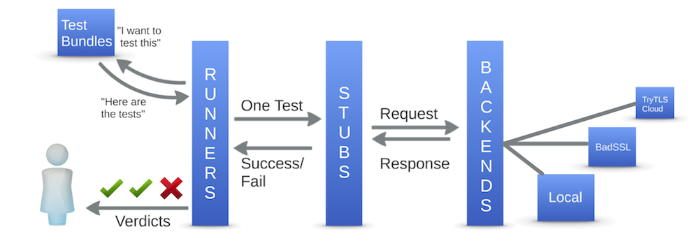

# TryTLS

Does *your* library check TLS certificates properly?
Broken certificate checks seems to be an overlooked issue.
Handling certificates is surprisingly complex, and calls for extra attention.

TryTLS is a tool for the software and library developers, vulnerability
researchers, and end-users, who want to use TLS safely.

We hope to help you to test certificate handling easily. We support
systematic and readily planned tests and try make integrating your
favorite language and library easy.

## How Does It Work?



 * **Backends** use ports and virtual hosts to provide falsified/broken certificate checks
 * **Stubs** are written for the target languages and libraries to attempt the TLS connection
 * **Runners** "check the checks" by calling the stubs systematically to find out
 how libraries handle signatures, domain names, time, SNI etc. against the backends

## Runners

We have a [Python based test runner](runners/trytls/) and a work-in-progress
[bash based test runner](runners/bashtls/).

### Installation

```sh
$ pip install trytls
```

In case you don't have [`pip`](https://pip.pypa.io/) installed, please refer to [these instructions](http://docs.python-guide.org/en/latest/starting/installation/).

### Usage

```sh
$ git clone https://github.com/ouspg/trytls.git
$ trytls https python trytls/stubs/python-urllib2/run.py
platform: OS X 10.11.5
runner: trytls 0.1.1 (CPython 2.7.10, OpenSSL 0.9.8zh)
stub: python 'stubs/python-urllib2/run.py'
 PASS expired certificate [reject expired.badssl.com:443]
 PASS wrong hostname in certificate [reject wrong.host.badssl.com:443]
 PASS self-signed certificate [reject self-signed.badssl.com:443]
  ...
```

## Stubs

Stubs and their documentation can be found from the [stubs/](stubs/) directory.

## Backends

We currently are working to support following backends:

 * [BadSSL](https://badssl.com) - we have cherry picked the [relevant tests](backends/badssl/README.md)
 * Local backend in the test runner itself (aka `localhost` backend)
 * [SSLLabs](https://ssllabs.com) - protection against [certain attacks](backends/ssllabs/README.md)
 * [Trytls backend](backends/trytls) both as docker based "run-it-yourself" packaging and as a
 hosted service provided by us [WIP]

Test runners allow user to test against all or any of these backends.

## What TryTLS Is Not

 * We do not address possible client certificate check problems in server code
 * We do not do or require a man-in-the-middle tools
 * We do not support smart TVs, IoT toasters and other such devices that can't run the test driver

## Found issues

  * [Wreq connection to HTTPS site with invalid hostname · Issue #84 · bos/wreq GitHub](https://github.com/bos/wreq/issues/84)
   * See also [Is Wreq suitable for HTTPS applications? · Issue #82 · bos/wreq · GitHub](https://github.com/bos/wreq/issues/82)
   * Related [http-client-tls connection to HTTPS site with invalid hostname · Issue #212 · snoyberg/http-client · GitHub](https://github.com/snoyberg/http-client/issues/212)

## Contributors

 * Mauri Miettinen ([@Mamietti](https://github.com/Mamietti))
 * Aleksi Klasila ([@aleksiklasila](https://github.com/aleksiklasila))
 * Jani Kenttälä ([@evilon](https://github.com/evilon))
 * Ossi Herrala ([@oherrala](https://github.com/oherrala))
 * Joachim Viide ([@jviide](https://github.com/jviide))
 * Marko Laakso ([@ikisusi](https://github.com/ikisusi))
 * Pekka Pietikäinen ([@ppietikainen](https://github.com/ppietikainen))
 * Joonas Kuorilehto ([@joneskoo](https://github.com/joneskoo))
 * Kasper Kyllönen ([@nkapu](https://github.com/nkapu))

We invite people to [contribute](CONTRIBUTING.md).

# Contact us
 * Preferred: public tweet
  * Use #trytls and point it to @oupsg
 * Less public alternative: direct twitter-message to @ouspg
