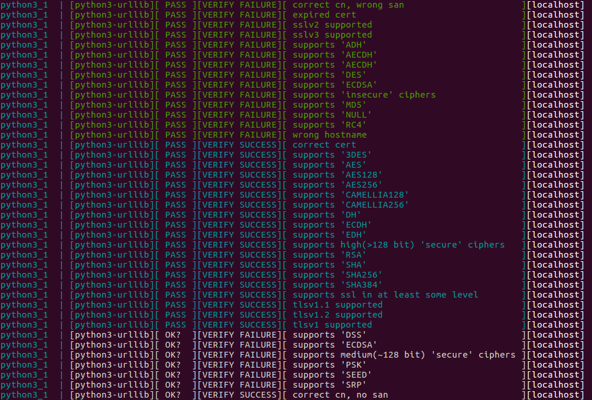
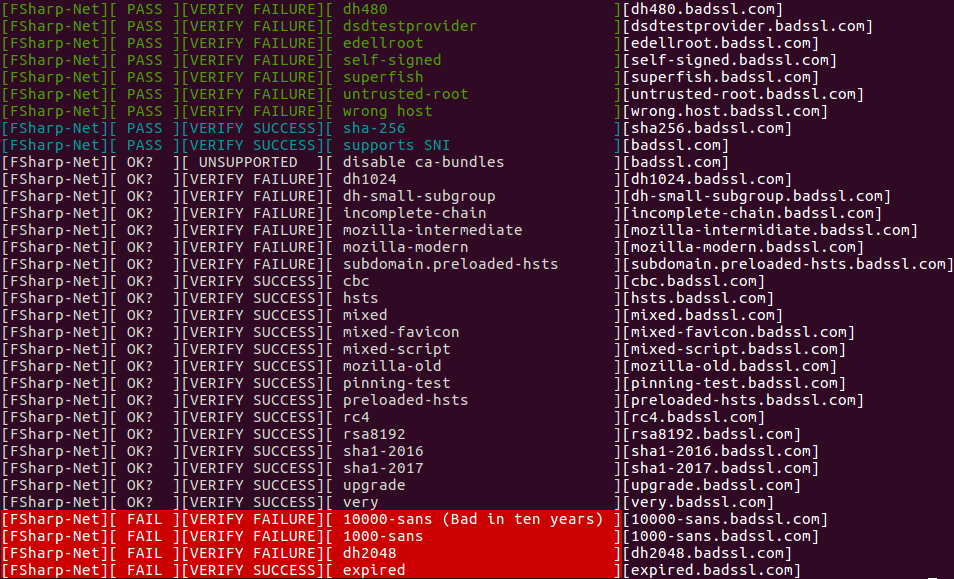

FACULTY OF INFORMATION TECHNOLOGY AND ELECTRICAL ENGINEERING

**Klasila Aleksi**

# TryTLS

Bachelor’s Thesis
Degree Programme in Computer Science and Engineering
07.2016

---

Klasila Aleksi (2016) TryTLS backend. University of Oulu, Degree Programme in Computer Science and Engineering. Bachelor’s Thesis.

## Abstract

**Encryption is a fundamental building block in protecting our privacy and safety of our society, unfortunately we may fail to use it properly. TLS (Transport Layer Security) has an important part in encrypting the connections on the Internet today. SSL (Socket Layer Security) is the deprecated and dangerous version of TLS. SSL should not be used anymore.**

**There are many protocols developed that use TLS. For example: HTTPS (Hypertext Transfer Protocol Secure), FTPS (File Transfer Protocol with support for TLS) and IMAP (Internet Message Access Protocol). All the protocols using TLS have also got many different implementations in different programming languages and libraries.**

**This thesis researches the tools used to test how different (client-) libraries implement TLS. This thesis also researches the known TLS/SSL vulnerabilities. In this thesis a backed for TLS testing purposes will be implemented.**

**Keywords: Security testing, Vulnerability research, Assurance tools, TLS, SSL, Security, Encryption**

---

Klasila Aleksi (2016) TryTLS backend. Oulun yliopisto, tietotekniikan tutkinto-ohjelma. Kandidaatintyö.

## Tiivistelmä

**TLS:llä on nykyisin tärkeä osa internet liikenteen salaamisessa ja turvallisuuden takaamisessa. SSL on TLS:n vaarallinen ja vanhentunut edeltäjä. TLS:ää käyttäviä protokollia, kuten HTTPS, FTPS ja IMAP on paljon. Ainakin tunnetuimille TLS:ää käyttäville protokollille on olemassa useita erilaisia toteutuksia eri ohjelmointikielillä ja kirjastoilla.**

**Tässä työssä tullaan tutkimaan kehitettyjä työkaluja TLS:n testaamiseen. Tässä työssä käsitellään myös osa tunnetuimmista TLS/SSL haavoittuvuuksista. Tässä työssä tullaan lisäksi rakentamaan järjestelmä, jolla voidaan selvittää kuinka eri kirjastot tukevat TLS protokollaa.**

**Avainsanat: Turvallisuus testaus, Haavoittuvuus testaus, testityökalut, TLS, SSL, Turvallisuus, Salaus**

---

## TABLE OF CONTENTS

<!-- START doctoc generated TOC please keep comment here to allow auto update -->
<!-- DON'T EDIT THIS SECTION, INSTEAD RE-RUN doctoc TO UPDATE -->

- [Abbreviations](#abbreviations)
- [1. Introduction](#1-introduction)
  - [1.1. Related research](#11-related-research)
  - [1.2. Aims](#12-aims)
  - [1.3. Description of the TryTLS backend approach](#13-description-of-the-trytls-backend-approach)
- [2. TLS/SSL IN ACTION](#2-tlsssl-in-action)
  - [2.1. The handshake protocol](#21-the-handshake-protocol)
  - [2.2. Motivation for the use of TLS](#22-motivation-for-the-use-of-tls)
  - [2.3. Motivation for the use of TLS testing](#23-motivation-for-the-use-of-tls-testing)
  - [2.4. Popular known vulnerabilities](#24-popular-known-vulnerabilities)
  - [2.5 Related protocols and approaches for securing connections on the internet](#25-related-protocols-and-approaches-for-securing-connections-on-the-internet)
  - [2.6. TLS testing](#26-tls-testing)
    - [2.6.1. Different approaches for testing the behavior of TLS libraries and clients during the TLS handshake](#261-different-approaches-for-testing-the-behavior-of-tls-libraries-and-clients-during-the-tls-handshake)
  - [2.7. Current testing approaches / State of the art](#27-current-testing-approaches--state-of-the-art)
    - [2.7.1 Overview](#271-overview)
    - [2.7.2 Tools and backends in more detail](#272-tools-and-backends-in-more-detail)
  - [2.8. Problems with the current testing approaches](#28-problems-with-the-current-testing-approaches)
- [3. TryTLS backend](#3-trytls-backend)
  - [3.1. Terminology](#31-terminology)
  - [3.2. Tools used](#32-tools-used)
  - [3.3. Setting up servers](#33-setting-up-servers)
  - [3.4. Testing TLS testing behavior of clients using TryTLS backend](#34-testing-tls-testing-behavior-of-clients-using-trytls-backend)
- [4. Testing](#4-testing)
  - [4.1. Generally](#41-generally)
  - [4.2. TryTLS backend configuration](#42-trytls-backend-configuration)
    - [4.2.1. Editing configuration](#421-editing-configuration)
  - [4.3. Output samples and conclusions](#43-output-samples-and-conclusions)
    - [4.3.1. Performance testing](#431-performance-testing)
    - [4.3.2. Test runs against backends](#432-test-runs-against-backends)
- [5. FUTURE RESEARCH](#5-future-research)
  - [5.1. Generally](#51-generally)
  - [5.2. TryTLS backend](#52-trytls-backend)
  - [5.3. Application Possibilities](#53-application-possibilities)
- [6. Conclusions](#6-conclusions)
- [7. References](#7-references)

<!-- END doctoc generated TOC please keep comment here to allow auto update -->

## Foreword

It was my job to work in the TryTLS core team to develop and popularize the TryTLS approach in order to help library and programming language developers to secure their use of the TLS encryption. We worked as a team on the whole TryTLS product and the TryTLS social enterprise and my specific area of responsibility was the selection, documentation and integration of the testing backends. I myself did all the research, testing and tools required during the creation of this thesis unless otherwise implied. 

There are vulnerabilities in current implementations using TLS in secure communications over the Internet. There are also many algorithms and protocols which are known to be vulnerable - even when implemented as supposed - and are still in use. That is one of the reasons why it is important to keep researching TLS and developing new tools to be used in testing TLS.

I would like to thank the research group OUSPG (Oulu University Secure Programming Group) and Oulu University for the job I got to do there at the summer 2016. I would also like to thank Juha Röning (Dr. Tech., Professor), Christian Wieser (DI) and all the others who have made it possible for me to write this thesis.

Oulu, Finland July 06.2016

## Abbreviations

<pre>
TLS/ SSL              Transport Layer Security/ Socket Layer Security
TCP/ UDP              Transmission Control Protocol / User Datagram Protocol
DTLS                  Datagram Transport Layer security
HTTPS                 Hypertext Transfer Protocol Secure
FTP                   File Transfer Protocol
FTPS                  FTP that adds support for the TLS and SSL cryptographic protocols.
IMAP                  Internet Message Access Protocol
SNI                   Server Name Indication
VM                    Virtual Machine
UI                    User Interface
DH                    Diffie-Hellman
RC4                   Rivest Cipher 4
LSB                   least significant bit
MUE                   Minimal Unauthenticated Encryption
KCI                   Key Compromise Impersonation
KDF                   Key Derivation Function
(J-)PAKE              (juglling) Password-Authenticated Key Exchange
DROWN                 Decrypting RSA with Obsolete and Weakened eNcryption
POODLE                Padding Oracle On Downgraded Legacy Encryption
BEAST                 Browser Exploit Against SSL/TLS
SLOTH                 Security Losses from Obsolete and Truncated Transcript Hashes
Freak                 Factoring RSA Export Keys
CRIME                 compression Ratio Info-leak Made Easy
</pre>

---

## 1. Introduction

>The TLS protocol provides communications security over the Internet. The protocol allows client/server applications to communicate in a way that is designed to prevent eavesdropping, tampering, or message forgery [2]. 

**First the thesis introduces TLS and some of the most known vulnerabilities related to it**

TLS has got a very important part in moving data securely in today’s Internet. TLS is used in money transactions and sending other sensitive information on the Internet – among other things.

There are a variety of different TLS libraries being used in creating the programs used in TLS communications. There are OpenSSL, GnuTLS, NSS and many more of them [10]. Some of the libraries are well researched, but some are not that well. TLS libraries are also used in developing new libraries. The developed libraries may use just a subset of the security (algorithms, protocols, etc.) offered by the ‘parent’ libraries. There are also under development libraries (both relatively old and new) being developed without the use of any existing libraries if not for commercial use then at least for private use.

It is important that the libraries are working correctly. It is not recommended by any means to use libraries that allow the client (or server) to be vulnerable to at least any of the known [attacks or vulnerabilities](#24-popular-known-vulnerabilities).

**Then the focus will change to researching the current state of the art tools and the TryTLS approach**

TLS can be used in both TCP (Transmission Control Protocol) and UDP (User Datagram Protocol). TryTLS focuses in TCP connections using TLS.

**After that comes the testing part, future research and the conclusions**

The testing part of the thesis focuses on testing the [performance](#431-performance-testing) of the developed tool. There will also be some [test runs](#432-test-runs-against-backends) and their conclusions. 

### 1.1. Related research

There are already [tools](#272-tools-and-backends-in-more-detail) developed to test if either server or client supports insecure ciphers, insecure protocol versions or allows insecure authentication. If the client (or server) does in fact support insecure connections or does some checks wrong the supposedly secure connection becomes relatively quickly insecure. There are many tools that can check whether if the server acts as supposed, however there are not so many tools that can check whether if client does the checking correctly or not, furthermore there are also not so many tools that tell what ciphers and protocol versions exactly does the client support at least not locally usable automated ones. [3]

The TLS protocol can be verified to be used correctly in many ways. Either the client or the server can reason it out during or after the TLS handshake. More about this [later on in this thesis](#21-the-handshake-protocol). Even if the connection is established it does not necessarily mean that the connection is secure because of the possible usage of for example: weak or insecure algorithms and keys. There are already many ways developed to be used to test for the weaknesses of used protocols, ciphers or keys. One could for example use NMAP to do automated testing, or use OpenSSL provided tools to do the testing manually. If both the client and the server support weak configurations of cipher suites and protocols the connection they communicate over has a great change of being vulnerable. [11]

The supported protocol versions, cipher suites and so forth can also be read in most cases from the library code itself. Although that sounds a very interesting subject of research it is not of real importance in terms of the scope of this thesis.

### 1.2. Aims

This thesis will research the current state of the art tools used in TLS-testing by developing one tool and testing some of the libraries using TLS. The main tool created and used during the testing part of the thesis is called TryTLS backend. It's known that the implementations of TLS are not perfect. It's also known that all the libraries used do not always use the state of the art algorithms and techniques to secure the TLS connections as will be seen [later on](#432-test-runs-against-backends) in the thesis.

There are (almost) never too many ways of testing anything. 

### 1.3. Description of the TryTLS backend approach 

**Backend [17]**

The TryTLS tool that can be easily set up to serve as a backend for manually testing TLS behavior and support of the clients trying to connect to it. It can be set up and ran on any of the most popular operating systems or if needed even on virtual machines (VM) as well. It can serve both remote and local connections. It performs very well even under heavy usage as shown in the [Testing section](#431-performance-testing) of the thesis. 

**Benefits [43]**

The backend can be set up and ran on a computer even without having Internet connection. No need for Internet connection means that it is relatively safe to test new libraries in action without having to worry about anyone eavesdropping the newborn library or protocol support taking it’s first steps in the world of wonders – surrounded only by the beauty of pure logic. It also means that the tests can be performed in such places where the Internet connection is either not available or free (safe) to be used - [there are still such places on the Earth](http://www.bbc.com/future/story/20140214-the-last-places-without-internet) - and who are we to prevent them from having the fun of testing TLS/SSL?

---

## 2. TLS/SSL IN ACTION

**Brief introduction [2]**

The [TLS protocol](https://tools.ietf.org/html/rfc5246) provides a relatively good support for secure connections when used correctly ([Tools](#272-tools-and-backends-in-more-detail) such as BadSSL or TryTLS can be used to determine the level of safety). It can also provide seemingly ‘secure’ (i.e. [insecure](#24-popular-known-vulnerabilities)) connections if used incorrectly. The protocol is mainly composed of two layers: [The record protocol](https://tools.ietf.org/html/rfc5246) and [the handshake protocol](#21-the-handshake-protocol). Normally the use of TLS can be seen from the usage of the letter ‘s’ in the name of the used Internet protocol. Sometimes the client may also show a picture of a lock of some sort. Among other protocols the HTTP(S), FTP(S) and IMAP protocols can use TLS to secure the connection if configured and used correctly on the both sides of the connection, the client- and the server-side.

This thesis will mostly concentrate on researching the Handshake protocol, i.e. the protocol for establishing the connection between client and server. The record protocol is used mainly after the connection has been established between the two participants. UDP over TLS/SSL is not a main theme of this thesis and the backend does not currently implement methods for testing UDP by for example: testing DTLS (Datagram Transport Layer security).

### 2.1. The handshake protocol

“When a TLS (SSL) client and server first start communicating, they agree on a protocol version, select cryptographic algorithms, optionally authenticate each other, and use public-key encryption techniques to generate shared secrets" [2].

The mostly used protocol versions are today (06.2016): TLSv1.0, TLSv1.1 and TLSv1.2. The ones that have been and may still - even though should not - be used in some cases are SSLv2, SSLv3. TLSv1.3 is currently under development and the major differences between it and TLSv1.2 can be seen in the ["The Transport Layer Security (TLS) Protocol Version 1.3"](https://tools.ietf.org/html/draft-ietf-tls-tls13-07)-draft or in [github](https://tlswg.github.io/tls13-spec/) [44]. The used cryptographic algorithms in TLS include algorithms for **Hashing**, **Encrypting**, **Authenticating** and **exchanging keys**. The combinations of these algorithms are called **cipher suites**. When the connection is about to be established the client sends the server the cipher suites - one of which it would like to use - in the order it would prefer them to be used during the connection with the server. The server either selects one of the wanted cipher suites and tells the client the (cipher) suite selected or the server simply says that it does not have the support required for any of the proposed suites. The connection also many times involves (sometimes optional) authentication which is normally done using **X.509 certificates**. Certificates are normally public - meaning that everyone can and need to get them to be able to connect to the server securely and authenticated. Some of the certificates (the ones that are publicly shared) can be seen for example using normal web browser. The encryption algorithms are used after the client and server have decided what suites to use and how to encrypt, etc. [12]

Picture 1. Example TCP TLS handshake (Firefox browser → https://badssl.com).

Figure 1. Simplified figure of the usage of the TLS protocol.

>**There are different methods for TLS handshaking but the one that’s explained above is currently the most used one when establishing a new TLS connection between a new client and a server.**

### 2.2. Motivation for the use of TLS

**Using TLS [13]**

TLS aims to provide secure Internet connections. It is the backbone of the secure Internet. By using secure TLS libraries in the correct manner sending and receiving messages is secure. The overall cost of using TLS is usually costlier for the servers (and clients) than just using plain text - but considering the advantages of using TLS provides, the plain text is in many cases not recommended. The cost of using TLS comes mostly from potential extra hardware required and also from the initial handshake part of the connection creation. Thus if keep alive and concurrent connections are enabled - because of the fact that decrypting and encrypting the data is trivial for modern computers and does not affect the performance of TLS much - the performance (throughput) of the connection is usually the same in normal use no matter if TLS was used or not.

**when the connection cannot be established for some reason when using TLS**

The connection can also be established in a secure manner and as encrypted in other ways than just by using TLS but the other ways and protocols are not as popular and easy to use as TLS is – at least not as securely. If a server does not support TLS it can use many services available to offer some security for example by using HTTPS connection between client and a security provider (service) providing authentication. The above method requires that the client supports SNI (Server Name Indication) which for example most modern browsers today do. The SNI support is one of the testing subjects when testing TLS support of libraries, i.e. does the client under test support SNI or not. In case the client does support SNI it can have at least some security during the connection even when the server does not support TLS - at least in the form of authentication [14]. There are also other ways to benefit from TLS without having an actual support for the protocol but they are mostly out of the main scope of this thesis.

### 2.3. Motivation for the use of TLS testing

There are a lot of potential TLS clients (and servers). Not just the browsers. "Does the client (server) really authenticate correctly and use safe cipher suites" is a really good question and an important subject to do research on. Are the certificates checked correctly? Are only the safe ciphers allowed or is the use of the less secure ones also an acceptable option. Sometimes it is just useful to know the suites and TLS protocol versions supported by the library in use. Creating a new library and want to test whether if the TLS handshake is done correctly or not? There are lots of reasons to do testing on TLS using the currently available tools and create new ones as well.

The world of security on the Internet is still an evolving one. It’s changing all the time.  New bugs get found and need to be batched either by retiring the insecure protocols and ciphers or finding other ways to batch (fix) them. New standards get developed. New algorithms find their way into the world of secure Internet communications. The capacity and the speed of computers increases every day – so does the attack surface of brute force required attacks. 

All the security used today is going to be outdated sometime in the future. New protocols and algorithms developed need to be tested correctly before using them, even if they are believed to be extremely safe at the time being.

### 2.4. Popular known vulnerabilities

There are basically two kind of vulnerabilities: Vulnerable algorithms and vulnerable implementations. Vulnerable algorithms may be due to actual bugs/flaws in algorithms. As time lapses the algorithms get old and hence may also become vulnerable. There are always vulnerable implementations no matter what the subject is. In case of TLS the number of vulnerable implementations are especially important to be kept as small as possible because of the importance of the protocol. There are several kind of vulnerable implementations that can be and have been made: checking certificates incorrectly, bugs in the libraries/programs, etc.

Most common attacks against TLS connections are Snooping, Man-in-the-middle, Injection and Buffer/numeric overflows[47]:
<pre>
Snooping attacks:                  Attacker sniffs the data in transit.
Man-in-the-middle attacks:         Attacker interposes its own computer between the client and the server.
Injection attacks:                 Attacker causes client or server to execute commands other than the inspected ones.
Buffer/numeric overflows:          Attacker causes program to read or write data in parts of it's address space where it should not.
</pre>
There are also other attacks such as[48]:
<pre>
SSL Stripping:                     Remove (SSL/TLS) altogether by modifying unencrypted protocols that request the use of TLS.
STARTTLS Command Injection Attack: "flaw where an application-layer input buffer retained commands that were pipelined with the STARTTLS command, such that commands received prior to TLS negotiation are executed after TLS negotiation".
Denial of Service:                 Mounting DoS attacks is still very real. TLS adds another vector for computational attacks.
And many more:                     https://tools.ietf.org/html/rfc7457
</pre>

The vulnerabilities/attacks describing in more detail in this section are:
<pre>
DROWN:           snooping, man-in-the-middle?
POODLE:          snooping
BEAST:           snooping
SLOTH:           snooping, man-in-the-middle
Pandora:         man-in-the-middle
FREAK:           man-in-the-middle
LOGJAM:          man-in-the-middle
Bar Mizvah:      snooping
Poodle:          snooping
Heartbleed Bug:  Buffer overflows and numeric overflows
Crime:           man-in-the-middle
Others:          snooping, man-in-the-middle, injection, Buffer overflow
</pre>

**DROWN [20]**

Drown stands for Decrypting RSA with Obsolete and Weakened eNcryption. “It allows an attacker to decrypt intercepted TLS connections by making specially crafted connections to an SSLv2 server that uses the same private key”. Many of the servers vulnerable to DROWN are also affected by Openssl bug that results in a significantly cheaper version of the attack and a larger attack surface.

**POODLE [21]**

POODLE stands for Padding Oracle On Downgraded Legacy Encryption. Any SSLv3.0 with CBC (Cipher Block Chaining) can be vulnerable to POODLE attack. POODLE allows attacker to decrypt selected content within the SSL session. POODLE attack can be performed in some cases even if the server and the client both support upper TLS versions by downgrading the connection during protocol version negotiation between the client and the server. The downgrading of course requires also the support of SSLv3.0 which is today deprecated and thus should not really be used anyways.

**BEAST [22]**

BEAST stands for Browser Exploit Against SSL/TLS. TLSv1.0 and earlier protocols allow attacker to guess what the plain text derived from the encrypted data looks like. With enough guesses the attacker can get enough information out of the encrypted data to decrypt cookies flowing by. The attack has been batched but the batch is not usually on by default. The attack was found by Juliano Rizzo and Thai Duong. This attack is still a valid one in some cases.

**SLOTH [31]**

SLOTH stands for Security Losses from Obsolete and Truncated Transcript Hashes. Usage of RSA-MD5 in TLSv1.2 leads client authentication to be broken and server authentication to possibly be breakable by a powerful adversary. “Partly as a consequence of this work, the TLS working group has decided to remove RSA-MD5 signatures and truncated handshake hashes from TLS 1.3“. MD5 signatures are still used in TLS today even though it has been known to be cryptographically broken since at least 2005.  Using MD5 means that the security of server signatures is 128 bits but using a transcript collision attack by Karthikeyan Bhargavan and Gaetan Leuren the effective security can be halved to about 64 bits and for other mechanisms such as TLS/SSL client authentication the security losses are even more dramatic.

Before TLSv1.2 the TLS/SSL client authentication signing hash function was always a concatenation of MD5 and RSA. TLSv1.2 allowed clients and servers negotiate algorithms they support and hence both the use of weaker and stronger algorithms. Many libraries and implementations (at least the older versions) allow the use of RSA-MD5 signatures. The arrack can be used in Man-in-the-middle client impersonation attack using collisions in the use of weak RSA-MD5 signatures. The attack takes up to several hours on Amazon EC2 instances. Attack can also Man-in-the-Middle Credential Forwarding Attack colliding two ClientFinished messages which are 96 bit HMAC hashes. This takes only up to 2^42 HMAC computations to calculate. This attack is important because about [31% of HTTPS servers are currently (2015) willing to send RSA-MD5 server signatures](https://securitypitfalls.wordpress.com/2015/12/07/november-2015-scan-results/). 

For more detailed information: [Transcript Collision Attacks: Breaking Authentication in TLS, IKE, and SSH] (http://www.mitls.org/downloads/transcript-collisions.pdf) by Karthikeyan Bhargavan and Gaetan Leuren.

**Pandora’s box – KCI [32]**

Key Compromise Impersonation (KCI) vulnerability is a weakness of an authenticated key exchange protocol that allows attacker who has compromised the secret client credentials (e.q. client certificate and corresponding secret key) of a victim to impersonate any server to the compromised client. If an attacker gets to install a client certificate in victim's computer the certificate can be used to also authenticate servers by leveraging the KCI vulnerability of certain cipher suites in TLS. Because the attacker can use client servers to impersonate a server there will usually be no warning displayed for the user when installing the certificates. All TLS fixed (EC)DH (Elliptic curve Diffie-Hellman) handshakes are vulnerable to KCI.

For more detailed information: [Prying open Pandora's box - KCI attacks against TLS] (https://www.usenix.org/system/files/conference/woot15/woot15-paper-hlauschek.pdf) by Clemens Hlauschek, Markus Gruber, Florian Fankhauser and Christian Schanes.

**FREAK [35]**

FREAK stands for Factoring RSA Export Keys. The attack targets a class of deliberately weak export cipher suites. These weak algorithms were introduced under pressure of US governments agencies while stronger algorithms were banned from export. By design an export cipher suite must be less than 512 bits long. It is very easy for an attacker to generate the modulus required to impersonate a server to vulnerable clients.

For more detailed information and links: [Freak: Factoring RSA Export Keys] (https://mitls.org/pages/attacks/SMACK#freak)

**Logjam [33]**

“The Logjam attack allows a man-in-the-middle attacker to downgrade vulnerable TLS connections to 512-bit export-grade cryptography.” The attack is reminiscent of the FREAK attack but is due to a flaw in TLS protocol and attacks DH(Diffie-Hellman) key exchange. 8.4% of the 1 million domains were initially vulnerable. The attack allows man-in-the-middle attacker to downgrade connections towards the server from client and take over the connection towards the client by impersonating the server. With 768 bit, 1024 bit or bigger keys much more time would be needed to implement the attack and thus such attack is not really valid with the current computers. It’s recommended to use primes of 2048 bits or larger because it would take far too many years to calculate the attack.

For more detailed information: [Imperfect Forward Secrecy: How Diffie-Hellman Fails in Practice] (https://weakdh.org/imperfect-forward-secrecy-ccs15.pdf) by David Adrian , Karthikeyan Bhargavan, Zakir Durumeric, Pierrick Gaudry, Matthew Green, J. Alex Halderman, Nadia Heninger, Drew Springall, Emmanuel Thomé, Luke Valenta, Benjamin VanderSloot, Eric Wustrow, Santiago Zanella-Béguelin and Paul Zimmermann

**Bar Mizvah - Breaking TLS with a 13-year old RC4 Weakness [34]**

“Rivest Cipher 4 (RC4) is the most popular cipher in the world even though it suffers a critical – and long known – weakness known as Invariance Weakness”. RC4 is not secure. RC4 is one of the simplest cryptographic algorithms. The data encrypted using RC4 is encrypted from the plaintext using pseudo random generated bytes that get XOR-ed with the corresponding plaintext bytes. 

The attack described can be used to mount partial plaintext recovery attacks on TLS/SSL-protected data. Using it one can recover up to 100 bytes of encrypted data. The usage of RC4 is distinguishable from random. During the attack the attacker first sniffs a large number of TLS/SSL connections encrypted with RC4, waiting for an arrival of a weak key. Attacker can then use statistical biases to aggregate tiny pieces of plaintext information using LSBs (least significant bits) of up to a hundred secret bytes. The attack can be used to brute force attack cookies.

For more detailed information: [Bar Mizvah - Breaking TLS with a 13-year old RC4 Weakness] (https://www.blackhat.com/docs/asia-15/materials/asia-15-Mantin-Bar-Mitzvah-Attack-Breaking-SSL-With-13-Year-Old-RC4-Weakness-wp.pdf)

**Poodle bites again [36]**

TLS’s padding is a subset of SSLv3 so SSLv3 decoding could be used in TLS and it would not cause any problems in normal operation. However SSLv3 decoding would not check the padding bytes which would make the POODLE attack to work against TLS connections as well. There are still sites that are affected by this.

For more detailed information: [The 	POODLE bites again] (https://www.imperialviolet.org/2014/12/08/poodleagain.html)

**Heartbleed Bug [37]**

"The TLS and DTLS implementations in OpenSSL 1.0.1 before 1.0.1g do not properly handle Heartbeat Extension packets, which allows remote attackers to obtain sensitive information from process memory via crafted packets that trigger a buffer over-read, as demonstrated by reading private keys, related to d1_both.c and t1_lib.c, aka the Heartbleed bug."

**Crime [38]**

Compression Ratio Info-leak Made Easy, i.e. The CRIME exploit was created by the security researchers Juliano Rizzo and Thai Duong, who also created the Beast exploit. The CRIME exploit allows an attacker to perform session hijacking on an authenticated web session over connections using HTTPS and SPDY (SPeeDY) protocols that also use data compression. The exploit against HTTPS and SPDY is mostly mitigated but against HTTP not so much.

**Others [23]**

There are many more vulnerabilities found all the time. In OpenSSL alone there have been at least 16 vulnerabilities that needed fixing in 2016 till today (06.2016).

### 2.5 Related protocols and approaches for securing connections on the internet

**Opportunistic security - in the context of communications protocols: [39, 40]**

Normally i.a. SMTP connections either authenticate and encrypt or do nothing special to secure the connection - at least when correctly implemented. The opportunistic security approach allows the use of encryption even when no authentication is available. The handshake between a SMTP server and a client begins with a STARTTLS command. The communication before the command is done in plain text which allows an attacker to prevent the command from having any real affect on the connection, meaning even though the client wanted to start using TLS/SSL the attacker can force the client to use plain text if the client does not force the usage of either authentication and encryption or no connection at all. 

“A publicly-referenced SMTP server MUST NOT require use of the STARTTLS extension in order to deliver mail locally.  This rule prevents the STARTTLS extension from damaging the interoperability of the Internet's SMTP infrastructure”

**Minimal Unauthenticated Encryption [1]**

MUE stands for Minimal Unauthenticated Encryption, i.e. the usage of as few round trips as possible. Designed against passive surveillance. Does not work against active ones. Offers a fast way within HTTP/2 to cause unauthenticated encryption. The protocol starts encryption within 3 messages (1.5 round trips). There are protocols that can start encrypting with less than that, but their error handling is much more complicated and they can also take sometimes more than just 2 round trips. MUE is negotiated in HTTP/2 headers. The two parties must agree to a shared preliminary key using (anonymous) Diffie-Hellman key agreement and derive the shared keys using agreed-to Key Derivation Function (KDF) and start encrypting messages.

The client is always the one who decides whether to start encrypting or not. The server can always Reject the encryption if it either doesn’t want to start encrypting with the client or doesn’t support any of the algorithms available. Doing encryption in the HTTP/2 means also that when moving to encrypt the connection changing port is not needed, the port 80 can still be used. MUE is only for HTTP but there is no security problem using HTTP that is carried under TLS.

**Password-Authenticated Key Excange [41]**

In Password-Authenticated Key Exchange (PAKE) two parties share a password which they both use to mutually authenticate. The protocol should not allow an attacker to obtain any information about the password through simple eavesdropping. The protocol uses Diffie-Hellman key exchange with a password as an extra layer of protection. J-PAKE means juggling PAKE in which the password is combined with ephemeral values like in the standard Diffie-Hellman key exchange instead of using only the password provided to obfuscate the inputs to a key exchange.

For more detailed information: https://www.normalesup.org/~fbenhamo/files/publications/SP_AbdBenMac15.pdf

**Others:**

There are many more protocols and approaches developed to be used either within or without TLS/SSL. Some of them are more secure and the others are less. The main scope of this thesis is in secure communications over TLS/SSL so this thesis won’t be getting much deeper into the protocol soup at hand for now.

### 2.6. TLS testing

No matter what internet protocol(s) are in use over TLS. The handshake part is almost always the same or at least a similar one. The protocol version, cipher suite, etc. get chosen during the handshaking. If the connection gets established the two participants - the client and the server - are to use the configuration negotiated. The actual data exchange (record) part of the connection is done differently when using different protocols. The record protocol is mostly out of the scope of this thesis.

**Introduction into TLS-testing**

Even though the world of TLS as we know it may be pretty secure for now. Who is to tell the code developed to be used in the future of the TLS and Internet won’t have any bugs or vulnerabilities. Without TLS testing there would be no way to be sure whether the code in use is safe or not. 

TLS/SSL testing via connection analysis consists of two essential things - client and server. It may also have a man in the middle who is sniffing the traffic.

#### 2.6.1. Different approaches for testing the behavior of TLS libraries and clients during the TLS handshake

**Server side testing**

Server side testing means that the information is mainly processed on the server side. The client is trying to create a connection and either does not want to know the result of the tests or does not want to know the result until the end of all the tests. The server on the other hand collects all the interesting data available.

The server can reason out what client supports and what it does not by observing both the connections established and the packets received. If a connection does not get established, the client either does not support the used configurations on the servers or the client does not want to connect to the server which is using broken or otherwise unsupported or unavailable certificates. If the connection does not get established the server cannot necessarily always be sure why the client was unable to connect. That is because the server does not always know whether if the client for example lost Internet connection or if the client could not support the proposed cipher suites (even though the client may have been telling otherwise) or terminated the connection for any other reason without even telling why.

The results get either sent back to the client or saved on the server after and during the connection. The result is sent back to the client after the tests and most likely also saved on the server side as well. For example: QUALYS SSL LABS offers free of charge tests for browsers [15].

**Client side testing**

Client side testing means that the information is processed at least on the client side. The client knows in most cases only what is on the server side behind certain ports or hosts. The client then tries to connect to the servers as it did when doing the server side testing. If and when the connection gets established the client knows what it (the client) supports or does not support or at least does not advertise the support for. The configuration on the server can of course be either a secure or a insecure one. The result is saved at least on the client side but most likely in a form or another on the servers as well.

There are tools that by using them client can check whether if it is vulnerable to certain attacks. There are also tools that let browsers to know what TLS/SSL protocol versions and cipher suites the used user agent supports. For example: QUALYS SSL LABS [15]. 

This thesis will mostly concentrate on the tools that test whether client supports only secure connections or if it also supports the less secure and insecure ones. The TryTLS backend provides one tool to be used in doing just that. The backend allows the user to save the results of the tests also on the server side if wanted.

**Packet sniffing**

One way of telling whether client (or server) supports insecure (or secure) connections is by sniffing the connections. Sniffing the packets flowing by and reading what client or server supports. The sniffing can be performed either on the client side, on the server side or in the middle of the both (in some cases). Of course this is in some ways much more difficult approach and thus not valid in most cases.

The server and the client exchange cipher suites, TLS/SSL version information and certificates in plain text and hence the information required to determine what the client supports (and does not) can be determined from the packets. By using the man in the middle approach it is not always possible to figure out what the server supports. That is because of the fact that the server does not necessarily need to send anything but the information the client requires to be able to determine whether if it can connect to the server or not and by using what configuration of cipher suites, protocols and so on. [16]

Figure 2. Main ways for testing TLS/SSL in action.

### 2.7. Current testing approaches / State of the art

#### 2.7.1 Overview

**Server [3]**

There are many tools for testing if server is doing TLS securely. Using for example Wormly Web Server Tester one can get a good overview about the security of a URL. There are also tools for checking the certificate signing request like Symantec SSL Toolbox or OpenSSL provided tools. This is useful to do before asking CA to sign a certificate. There are many more tools but they are mostly outside of the main scope of this thesis or at least outside of this overview. 

**Client**

There are not so many tools for testing the TLS support of different clients and libraries used in TLS. There are of course some. For example: BADSSL is a service by using of which one can manually test whether if client performs TLS as wanted. QUALYS SSL LABS provides also some manual tests for the clients. TryTLS backend is mainly for client side testing of client's TLS support but can also be used on the server side for testing the client's TLS support.

#### 2.7.2 Tools and backends in more detail

**BADSSL [4,17]**

BADSSL is one of the few sites/servers which allows anyone to try to connect and manually figure out whether if something goes wrong when using the code or library at hand or not. The BADSSL-servers can also be downloaded onto a computer but the servers cannot be shared with public easily. BADSSL is meant for manual testing of security UI (user interface) in web clients and is an unofficial Google product. 

**QUALYS SSL LABS [15, 25]**

QUALYS SSL LABS offers free of charge tests mainly for browsers. They have also many more projects going on. They offer deep analysis of the configuration of any TLS/SSL web server on the public Internet and have documents, surveys and many different analysis tools for TLS/SSL testing.

**WORMLY - FREE DIAGNOSTIC TOOLS [26]**

Tests and diagnostic tools for different kind of servers that support TLS. There are tools for i.a. HTTPS, FTPS, POP3 and HTTP and FTP servers. Wormly also offers services for monitoring app stack and sites.

**SYMANTEC [27]**

Tools for creating certificate signing requests and checking that they are formatted properly. They also sell certificates and other Cyber security related services and protection.

**Others (some of the most popular ones)**

<pre>

SSL Shopper:                Quick tool for checking TLS servers [3].
GlobalSign SSL Check:       Detailed tool for checking TLS servers [3].
COMODO SSL Analyzer:        Quick scan for HTTPS URL [3].
SSL Checker:                TLS/SSL checker that can be set to remind 30 days before a certificate expires [3].
HowsMySSL:                  Tool for testing browsers TLS/SSL support/compatibility [3].
DigiCert:                   TLS certificate installation diagnostics tool and certificate management services among other things[29].
SSLSmart:                   Tool aimed at improving efficiency and reducing false positives during TLS testing [28].
SSL Checker:                Tool for showing TLS certificate details [30]
CSR Decoder:                Tool for verifying the details of a certificate [30]
SSL Finder:                 Tool for finding best match TLS product [30]

</pre>

### 2.8. Problems with the current testing approaches

The current tools that check whether if the client supports insecure configurations need at least mostly internet connection to work properly and that can be seen as a problem in some cases. These tools are mostly internet sites. There are also tools for checking Certificates. But there are not many tools for checking whether if client checks the certificates correctly or not. With BADSSL and TryTLS one can of course do just that. [3]

Most of the current approaches are also in a way more difficult to reconfigure for the needs of individuals. TryTLS tries to make the process on reconfiguration as easy as possible. Obviously as seen there are already tools that provide at least some sort of testing environment for TLS clients to test on but they are in one way or another different from the TryTLS backend and as it often times is with testing tools – There are newer too many of them.

## 3. TryTLS backend

Figure 3. Simple figure of the TryTLS backend

### 3.1. Terminology

In this thesis term ‘connection’ refers mostly to a TCP connection between a client a server. Connections between clients and the TryTLS backend servers are mainly HTTPS connections even though it is possible to test for example IMAP or FTPS connections using the TryTLS backend.

### 3.2. Tools used

**Docker [5, 17]** 

Docker is a virtualization software. It is an open source project to pack, ship and run any application as a lightweight container. Docker relies on a sandboxing method called containerization. Docker containers wrap a piece of software in a complete file system. Docker containers are small and the performance overhead is almost zero. Containers are also completely portable and the design is application-centric instead of being hardware-centric as the traditional virtualization methods tend to be. Docker operates at the OS level, so it can even be ran inside a VM (Virtual Machine). Docker can be used on multiple Operating Systems such as Linux, Windows and Mac. It can be ran on any infrastructure. The containers are also isolated from one another by default.

In the TryTLS backend the nginx servers and files required to run the servers are placed inside a docker container. Docker provides an easy way to ship the backend from one computer to another. Using docker to virtualize servers assures very short maintenance breaks when updating the servers. The servers need to be shut down only when rebuilding and restarting the containers (servers).

**Bash [6, 45]**

Bourne Again Shell is [sh(Shell Command Language)](http://pubs.opengroup.org/onlinepubs/009695399/utilities/xcu_chap02.html) -compatible and most sh-scripts can be run by bash without modifications. Bash is default shell on most Linux and OS X distributions. Bash is almost 30 years old language. During the testing part of this thesis mostly bash and python are used. In the TryTLS backend bash scripts generate the servers and docker files used to build the docker images and to run the built images. 

**nginx [7]**

“nginx [engine x] is an HTTP and reverse proxy server, a mail proxy server, and a generic TCP/UDP proxy server, originally written by Igor Sysoev.”.

Nginx is used by many of the most popular sites like Netflix. Nginx open source project started 2002. Nginx offers an easy way to create very powerful servers in a short time. It can also be used in docker containers as is done in TryTLS backend.

**Openssl [8]**

Openssl is and Open source project. It is a toolkit for TLS and SSL protocols. It also comes with a general-purpose cryptography library. Openssl is used in TryTLS backend to generate the self signed certificates used. Openssl is also used in Nginx servers. Openssl is one of the most popular libraries used in TLS both in server and client sides.

### 3.3. Setting up servers

Figure 4. Setting up the TryTLS servers

Setting up the TryTLS backend is easy. A init-script generates files that docker needs. It takes host name, port, protocol and services (differently configured servers) as command-line arguments. Currently implemented version of the backend only supports HTTPS protocol.

Figure 5. Building and running the servers

**Setting up servers on localhost**

When setting up the TryTLS backend the host name can also be set either to localhost or 127.0.0.1. By running the init-script and setting host name to localhost the certificates and servers are generated especially for the localhost.

**Setting up public servers**

If the host name is set to either to the public IP (Internet Protocol) address of a computer or to a domain name that points to an IP address one can try to connect to the servers and therefore clients against the servers running on a computer. 

When the init-script is executed it generates files and folders in a folder called ‘tmp’. It also generates the actual server files in a folder called ‘servers’. Inside the tmp-folder is a folder named as "certs" and a file named as "conf" among others. If both the certs-folder and the conf-files of all the servers publicly running were shared in a same place it would be possible for people to create different configurations on their servers and let the runners that run the stubs trying to connect to given servers test all the servers by looping through all the conf-files and the correct certificate. The certificates the TryTLS backend uses are generated using the init-scripts but the certificates that TryTLS uses when running can also be generated in other ways if wanted.

**Setting up other servers using the TryTLS backend [9]**

The TryTLS backend int-scripts are coded is such a way that it is easy to change the now generated HTTPS servers for example into FTPS servers. Because of the usage of docker even the nginx can be changed into another for example to vsftpd which is used in FTPS servers.

### 3.4. Testing TLS testing behavior of clients using TryTLS backend

To test if a client allows usage of insecure connections or not it is required to be able to run the client on a computer - Alternatively use one of the runners available can be used. There are many runners already developed. One of the runners developed can run any code (stub) wanted against any number of backends using many different drivers. Using multiple drivers in one runner allows testing the client (stub) in action using many different versions of the software or libraries needed to run the stub developed or even different operating systems to run the drivers and stubs on.

Figure 6. Running stub against the backend using bashTLS with one driver (similar figure with other runners)

## 4. Testing

### 4.1. Generally

In this thesis the testing is done by trying to connect the client to both insecurely/wrongly and correctly but still differently from each other configured servers. The testing is done mainly on the client side although when using the TryTLS backend locally the servers are also available if needed.

### 4.2. TryTLS backend configuration

The testing against TryTLS backend was done by trying to connect to the differently configured ports open. Running the init-script generates files. Among the files generated there is a file called conf-file inside of which can be found all the different configurations on the different ports on the particular servers.

Picture 2. Example conf-file. Includes port, message, status, certificate and host name fields.

**Default configuration**

The default configuration of the TryTLS-backend includes tests for the support of different versions of TLS/SSL protocols. There are also tests for testing the support of different cipher suites and incorrect certificates.
The default configuration is easily editable. By running the init-scripts with different command-line arguments one can remove (add) the wanted tests from (to) the default configuration.

#### 4.2.1. Editing configuration

Editing default configuration is easy. Only thing needed to do is add/remove the wanted lines in the configuration folder of the particular protocol used. If testing TLS handshake and client’s support for TLS the configuration used is best to be kept as it is.

When using edited configuration files, it is especially important to use the newly created conf-file as well. That’s because of the changed configurations behind different ports. The conf-file is universally usable, i.e. the same kind of files can be created (and have already been created) for other backends - like BADSSL - as well.

The scripts are also written in such a way that it is not too hard to edit them if wanted for example by adding new ways for certificates to be broken or adding new commands to be used in the configuration files.

### 4.3. Output samples and conclusions

#### 4.3.1. Performance testing

**Aims**

Performance testing is always an important part of testing new tools. It shows the best ways to use the tools and it also tells whether if the tools are really usable or not in the sense of being at least reasonably good with not wasting too much time.

**Setup**

The tests were performed using 64 bit Linux Ubuntu 16.04 laptop with Intel core i3 2.27 GHz, normal networking controllers and 4 gigs of ram.The tests are done using python3 and urllib in the client’s code. The server side is the TryTLS backend with default configurations. 

**Procedure**

All the tests are done 10 times and the values represented are the average values of the actual values measured during the 10 tests. At the beginning of each test the servers have been rebooted. During a test clients try to connect to all the servers up and running. If the connection is established the client also makes a Get request for a HTML file. The size of the HTML file is minimal. Once the HTML file has been safely received by the client or something has gone wrong with the connection - the connection gets terminated. These tests test not only the speed of creating connection – the handshake protocol part of the connection - but they also measure the speed of cryptography - the record protocol part of the connection. This is to make sure the backend can also be used in testing TLS record protocol in the future if seen needed.

---

**CASE STUDY 1**

**Setup and Procedure**

The first tests were made setting up one backend with different numbers of servers and containers. During the tests there were never more than one client trying to connect at a time. The time it took from a client to connect to a server and end the connection was recorded and the result is shown in the table below. The servers were easy to set up and terminate because of the usage of docker.

**Analysis**

It can be seen that the servers are very fast even though the client and the servers are running on the same machine. Within certain range of servers up there is really no noticeable change in the rate of connections established. It took about 200 milliseconds for the client to try and create a connection and optionally make a GET request for a HTML file if connection got established. 

This shows that the backend can in fact be used in testing TLS libraries - at least with only one connection to a port at a time. This also shows that the NGINX servers are performing very well and hence NGINX is a great choice to be used pretty much in any kind of TLS testing software/projects.

**Results**

Chart 1. Summary of test runs of the TryTLS backend with single client.

Number of containers | Number of servers | Seconds per connection (only one connection at a time)
------------ | ------------- | -------------
1 | 39 | 0.18
1 | 90 | 0.18
1 | 180 | 0.18
1 | 360 | 0.17
1 | 420 | 0.19
1 | 450 | 0.20
1 | 840 | 0.66
2 | 78 | 0.19
4 | 117 | 0.18
5 | 156 | 0.20
6 | 195 | 0.20
7 | 234 | 0.18
8 | 273 | 0.18

---

**CASE STUDY 2**

**Setup and Procedure**

The tests were made setting up one backend with 8 containers and up to 273 servers. The tests were performed otherwise the same way as during the ‘CASE STUDY 1’ but now the number of clients (connections) was the changing variable. All the clients are trying to connect to the same port at the beginning of the tests. Once a client gets connected it moves to the next port and so on.

**Analysis**

Yet again the rate in which the connections were established was very good until certain limit of simultaneous connections. Probably with better computer this test would have had better results but I had no change of finding that out. The chart looks pretty similar to that of the ‘CASE STUDY 1’.

At the beginning (with small number of clients) adding more simultaneous connections (clients) increases the performance. i.e. decreases the time it takes a client to try and connect to a server (port), do what needs to be done and terminate the connection. To a point it is useful to add more connections but adding too many connections in turn slows the servers down considerably.

This shows that the backend can also be used with many simultaneous connections to a server/port. This also shows the best number of connections is not one connection but more like four or more.

**Terms**

The ‘seconds per connection’ term means it took that much time for one client to connect to a server, get the HTML page and terminate the connection or just try to connect and terminate the connection if the client had no success when handshaking. Only one connection can connect (bind) to one port at the same time and all the clients are trying to connect to the same ports at least at the beginning of the test runs.

**Results**

Chart 2. Summary of test runs of the TryTLS backend with multiple clients.

Number of connections | Seconds per connection
------------ | -------------
1 | 0.18
2 | 0.082
4 | 0.069
8 | 0.097
16 | 0.11
32 | 0.11
64 | 1.00
128 | 2.8

---

#### 4.3.2. Test runs against backends

**Client side**

**Aims**

The main purpose for performing these test runs is to show that some of the libraries are relatively safe to use - when updated.

**Terms**

‘[VERIFY FAILURE]’ means the connection did not get established and ‘[VERIFY SUCCESS]’ means the connection did get established. ‘[ PASS ]’ means the connection worked as supposed and the ‘[ FAIL ]’ means that the test was a failure, i.e. did not go as well as wanted. ’ [   OK?   ]’ means the establishment of the connection is ok in some cases and bad in some cases. 

---

**CASE STUDY 1**

**Analysis**

Python3 with urllib is fairly safe to be used. It checks for expired certificates, wrong hosts, etc. It also uses only the current modern algorithms to secure the connection and not the old/obsolete ones at all. This does not of course mean that the urrlib does not support the old ones but it means that at least the library does not advertise and use those natively which of course provides more secure communications.

**Results**

Picture 3. Test run against TryTLS-backend using BashTLS-runner and python3-urllib stub.

---

**CASE STUDY 2**

**Analysis**

[Mono](http://www.mono-project.com/) [42] is a software development environment. The above output is the same when using other mono supported languages such as C# and visual basic which also support the usage of .Net framework as did F# when using 4.2.1 version of Mono. The usage of this king of libraries is not very safe and secure to be used in many situations at least natively and unmodified. They do not check for expired certificates and They advertise and use the (in most cases) old/obsolete algorithms.

**Results**

Picture 4. Test run against BADSSL-backend using simplerunner (runner that BashTLS drivers use) and FSharp-net stub using Mono (Mono JIT compiler version 4.2.1, see below).

Picture 5. Using Wireshark to check what cipher suites client (Mono + .Net + FSharp) supports.

**More information**

There are already newer versions of Mono available on [github](https://github.com/mono) [46]. When running the tests with Mono - version 4.5 or above - the output of the tests looks pretty similar to that of the python3-urllib tests. It is important to have the latest version of Mono before using C#, F# or other Mono depended languages. Similar kind of behavior can be seen with older versions of OpenSSL (tested on Ubuntu 16.04 default version with c-OpenSSL stub) and other libraries. It is recommended to update the libraries about to be used before any serious usage.

---

**Server side**

**CASE STUDY 1**

As it can be seen below the data could be gathered and processed on the server side if wanted. Obviously just by saving the log files it could be later on reasoned out with pretty good accuracy what the client that tried to connect supports and what it does not.

**Results**

Picture 6. Test run against TryTLS backend using BashTLS-runner and python3-urllib stub as a client.
 

## 5. FUTURE RESEARCH

### 5.1. Generally

**Tools**

There are quite a few tools for checking TLS support and behavior of libraries already but there are neither many good tools that use the combined power of different testing methods and results available efficiently nor the best possible documentations how to use the already existing tools to gain the best results possible or at least there used not to be. There are researches going on trying to gather information about existing tools and vulnerabilities, for example: SSL Labs has been doing this among other things since 2009 and will hopefully keep up the good work. [19]

**Vulnerabilities**

There are still network UI (User Interface) clients that use SSLv2, SSLv3 or TLSv1.0 - many of the used libraries do this by default if not updated correctly - even though there are a lot of issues and vulnerabilities like DROWN attack (SSLv2), POODLE attack (SSLv3) and possibility for BEAST attack (TLSv1) if not mitigated correctly. TLSv1.1 and TLSv1.2 are still without known serious security issues and it’s recommended to support at least the usage of TLSv1.2 because only it provides modern cryptographic algorithm. The fact that the TLSv1.1 and TLSv1.2 are without known security issues does not necessarily mean that there aren’t any or at least that there won’t be any in the future. [19]

**Evolution**

In the future it’s important to research new ways to make TLS more secure, more efficient and especially more widely used protocol. The currently most popular TLS protocol versions and algorithms should be researched in the future. Even the old protocols such as TLSv1.0 should still be researched because they are still widely used. The currently running TLS-testing sites/servers should also be updated as the evolution of TLS and secure Internet goes forward.

### 5.2. TryTLS backend

There is quite a lot of potential in the TryTLS backend. It is very configurable and could potentially be used in various other kind of experiments and test in the future. It will be seen what the future holds for the backend if it in fact does.

**Certificates**

There are and will be especially in the future a lot of different ways for the certificates generated to be broken than the current versions of the scripts and configuration files provide for now. But now that the TryTLS backend is working and easily configurable the updating of the backend won’t be particularly difficult.

**Vulnerabilities**

The backend could also provide information about whether if the client trying to connect to the server is vulnerable to the known vulnerabilities.

### 5.3. Application Possibilities

**Cloud**

As mentioned before the TryTLS-backend could also be used in various different kind of servers and secure internet connection tests. The backend could also be extended in many other ways. The init-scripts create conf-files and certificates when ran. If there was a service sharing these conf-files and certificates anyone could participate into making the usage of TLS client safer by configuring their servers differently than the other participants have. This is one thing that may need to be considered if seen useful.

**Other tools and possibilities**

The backend created could also be a part of something bigger. It could be combined together with different tools created for testing TLS. It can also be used for creating virtual servers for sites with variety of purposes if configured correctly. 

There are also a lot of different tools for TLS testing purposes that could be created but haven’t been at least yet. These tools to be developed include better tools for testing the TLS support of clients by sniffing the packets sent and received. This can obviously be done using for example Wireshark or sites/servers on the Internet, but a real time automated locally usable, easily configurable tool would be better suited for the job in some cases. One of the internet sites designed for this is DC Sec [24]. Even though the approach described would still require a responding web server to be useful it is very doable also with the TryTLS backend.

Picture 7. Using Wireshark to check what cipher suites client (Firefox) supports.

## 6. Conclusions

**Goal**

The main goal of this thesis was to show and research the fact that it is possible to do TLS testing for different programming languages and libraries without and within internet connection. The thesis is also about creating a software or tool that anyone can with relatively small amount of work set up and get running in no time if wanted. There are already similar tools out there on the Internet just waiting to be used more in TLS testing.

**Tools**

Even though there are tools for testing the TLS protocol still many of the libraries used do something wrong or insecurely or let the client do something insecurely without even always really providing the possibility of choosing whether to accept the connection or not. With the created backend and also with many of the existing other tools anyone can check whether if the code used can connect - even though not necessarily wanted – insecurely either using known vulnerabilities or natively (without having to even use any ‘real’ vulnerabilities). The TryTLS backend is very fast and comes with a great potential both for configuring the servers as needed and testing TLS libraries as it is.

**Libraries**

The current state of the most used libraries seems to be in pretty good shape if updated and used correctly. The versions of the libraries before updating are not always very secure to be used - but as long as it is known that the libraries need to be updated before any serious usage there seem not to be any real danger in there.

**General**

It should always always be possible to test the code using any of the tools available or creating new ones if needed. Including TryTLS backend. Of course the code is not necessarily safe even if it passes all the tests. Or it can be safe for now but the future will always bring us new challenges. Isn’t that just the point of living – having difficult(ish) challenges?

## 7. References

[1] P. Hoffman. VPN Consortium. "Draft-Hoffman-Httpbis-Minimal-Unauth-Enc-01 - Minimal Unauthenticated Encryption (MUE) For HTTP/2". Tools.ietf.org. [online] Available: https://tools.ietf.org/html/draft-hoffman-httpbis-minimal-unauth-enc-01 [Accessed 15 Jul. 2016].

[2] T. Dierks. E. Rescorla. RTFM, Inc. RFC 5246. - The Transport Layer Security (TLS) Protocol Version 1.2". Tools.ietf.org. [online] Available: https://tools.ietf.org/html/rfc5246 pp. 32-33 [Accessed 11 Jul. 2016].

[3] C. Kumar. Infrastructure, Web et al. "10 Online Tool To Test SSL, TLS & Latest Vulnerability". Geek Flare. [online] Available:  https://geekflare.com/ssl-test-certificate/ [Accessed 11 Jul. 2016].

[4] "Badssl.Com". Badssl.com. [online] Available: https://badssl.com/ [Accessed 11 Jul. 2016].

[5] "What Is Docker?". Docker. [online] Available: https://www.docker.com/what-docker [Accessed 11 Jul. 2016].

[6] "Bash - GNU Project - Free Software Foundation". Gnu.org. [online] Available: https://www.gnu.org/software/bash/ [Accessed 11 Jul. 2016].

[7] "Nginx". Nginx.org. [online] Available: https://nginx.org/en/ [Accessed 11 Jul. 2016].

[8] OpenSSL Foundation, Inc. "Openssl". Openssl.org. [online] Available: https://www.openssl.org/ [Accessed 11 Jul. 2016].

[9] "Vsftpd - Secure, Fast FTP Server For UNIX-Like Systems". Security.appspot.com. [online] Available:  https://security.appspot.com/vsftpd.html [Accessed 11 Jul. 2016].

[10] "Curl - SSL Libraries Compared". Curl.haxx.se. [online] Available: https://curl.haxx.se/docs/ssl-compared.html [Accessed 11 Jul. 2016].

[11] "Testing For Weak SSL/TLS Ciphers, Insufficient Transport Layer Protection (OTG-CRYPST-001) - OWASP". Owasp.org. [online] Available: https://www.owasp.org/index.php/Testing_for_Weak_SSL/TLS_Ciphers,_Insufficient_Transport_Layer_Protection_(OTG-CRYPST-001) [Accessed 11 Jul. 2016].

[12]  GMO GlobalSign Inc. Available: https://www.globalsign.com/en/resources/white-paper-ssl-secure-server-certificates.pdf And Tools.ietf.org. (2016). RFC 5280 - Internet X.509 Public Key Infrastructure Certificate and Certificate Revocation List (CRL) Profile. [online] Available: https://tools.ietf.org/html/rfc5280 [Accessed 20 Jul. 2016].

[13] "Why SSL? The Purpose Of Using SSL Certificates". Sslshopper.com. [online] Available:  https://www.sslshopper.com/why-ssl-the-purpose-of-using-ssl-certificates.html [Accessed 11 Jul. 2016].

[14] Matthew Prince. (2014). "Introducing Universal SSL". CloudFlare. [online] Available:  https://blog.cloudflare.com/introducing-universal-ssl/ [Accessed 11 Jul. 2016].

[15] "Qualys SSL Labs". Ssllabs.com. [online] Available: https://www.ssllabs.com [Accessed 11 Jul. 2016].

[16] Sarath Pillai. (2013). "Understanding SSL Handshake Protocol". slashroot.in. [online] Available:  http://www.slashroot.in/understanding-ssl-handshake-protocol [Accessed 11 Jul. 2016].

[17] "Docker/Docker". GitHub. [online] Available: https://github.com/docker/docker [Accessed 11 Jul. 2016].

[18] "Google/Badssl.Com". GitHub. [online] Available: https://github.com/google/badssl.com [Accessed 11 Jul. 2016].

[19] "Ssllabs/Research". GitHub. [online] Available: https://github.com/ssllabs/research/wiki/SSL-and-TLS-Deployment-Best-Practices [Accessed 11 Jul. 2016].

[20] Sarah Madden. Christian Dresen. "DROWN Attack". Drownattack.com. [online] Available: https://drownattack.com/ [Accessed 11 Jul. 2016].

[21] POODLE. "SSL 3.0 Protocol Vulnerability And POODLE Attack | US-CERT". Us-cert.gov. [online] Available:  https://www.us-cert.gov/ncas/alerts/TA14-290A [Accessed 11 Jul. 2016].

[22] Duong, Thai. "Thái: BEAST". Vnhacker.blogspot.fi. [online] Available: https://vnhacker.blogspot.fi/2011/09/beast.html [Accessed 11 Jul. 2016].

[23] OpenSSL Foundation, Inc. "Openssl". Openssl.org. [online] Available: https://www.openssl.org/news/vulnerabilities.html [Accessed 11 Jul. 2016].

[24]  DCSEC research group at Leibniz University Hannover. "SSL Cipher Suites Supported By Your Browser". Cc.dcsec.uni-hannover.de.  [online] Available: https://cc.dcsec.uni-hannover.de/ [Accessed 11 Jul. 2016].

[25] Qualys, Inc. "Qualys SSL Labs - Projects". Ssllabs.com. [online] Available: https://www.ssllabs.com/projects/index.html [Accessed 12 Jul. 2016].

[26] "Server Monitoring, Web Site Monitoring And Uptime Monitoring - Wormly". Wormly.com. [online] Available: https://www.wormly.com/ [Accessed 12 Jul. 2016].

[27]  Symantec Corporation. "Symantec - Global Leader In Next-Generation Cyber Security | Symantec". Symantec.com. [online] Available:  https://www.symantec.com/ [Accessed 12 Jul. 2016].

[28] "Sslsmart | Mcafee Free Tools". Mcafee.com. [online] Available: http://www.mcafee.com/us/downloads/free-tools/sslsmart.aspx [Accessed 12 Jul. 2016].

[29] "SSL Digital Certificate Authority - Encryption & Authentication". Digicert.com. [online] Available: https://www.digicert.com/ [Accessed 12 Jul. 2016].

[30] ClickSSL. "SSL Tools". SSL Certificates by ClickSSL - Cheap Price, Best Quality & Support. [online] Available:  https://www.clickssl.net/ssl-tools [Accessed 12 Jul. 2016].

[31] INRIA Paris. INRIA Paris. "Mitls, Triple Handshake, SMACK, FREAK, Logjam, And SLOTH". [online] Available: Mitls.org. [Accessed 13 Jul. 2016].

[32] Clemens Hlauschek, Markus Gruber, Florian Fankhauser and Christian Schanes. Prying open Pandora’s box: KCI attacks against TLS. [online] Available: https://www.usenix.org/system/files/conference/woot15/woot15-paper-hlauschek.pdf [Accessed 12 Jul. 2016].

[33] David Adrian , Karthikeyan Bhargavan, Zakir Durumeric, Pierrick Gaudry, Matthew Green, J. Alex Halderman, Nadia Heninger, Drew Springall, Emmanuel Thomé, Luke Valenta, Benjamin VanderSloot, Eric Wustrow, Santiago Zanella-Béguelin and Paul Zimmermann. "Imperfect Forward Secrecy: How Diffie-Hellman Fails in Practice". [online] Available: https://weakdh.org/imperfect-forward-secrecy-ccs15.pdf and [online] Available: https://weakdh.org/ [Accessed 13 Jul. 2016].

[34] Blackhat asia-15. Bar Mizvah - Breaking SSL with a 13-year old RC4 Weakness. [online] Available:  https://www.blackhat.com/docs/asia-15/materials/asia-15-Mantin-Bar-Mitzvah-Attack-Breaking-SSL-With-13-Year-Old-RC4-Weakness-wp.pdf [Accessed 13 Jul. 2016].

[35] "Mitls, (2015), Triple Handshake, SMACK, FREAK, Logjam, And SLOTH". Mitls.org. [Accessed 13 Jul. 2016]. [online] Available: https://mitls.org/pages/attacks/SMACK#freak

[36] Langley, Adam. (2014) "Imperialviolet - The POODLE Bites Again". [online] Available: Imperialviolet.org. [Accessed 13 Jul. 2016].

[37] "CVE -CVE-2014-0160". [online] Available: Cve.mitre.org. [Accessed 13 Jul. 2016].

[38] Kelsey, John. "Compression And Information Leakage Of Plaintext". Fast Software Encryption: 263-276. [online] Available:  https://en.wikipedia.org/wiki/CRIME and https://en.wikipedia.org/wiki/CRIME#References [Accessed 13 Jul. 2016].

[39] V. Dukhovni. Two Sigma. "Draft-Dukhovni-Opportunistic-Security-06 - Opportunistic Security: Some Protection Most Of The Time". Tools.ietf.org. [online] Available: https://tools.ietf.org/html/draft-dukhovni-opportunistic-security-06 [Accessed 14 Jul. 2016].

[40] Facebook. (2014). "The Current State Of SMTP STARTTLS Deployment". M.facebook.com. [online] Available: https://m.facebook.com/notes/protect-the-graph/the-current-state-of-smtp-starttls-deployment/1453015901605223/ [Accessed 15 Jul. 2016].

[41] Michel Abdalla. Fabrice Benhamouda. Philip MacKenzie. "Security of the J-PAKE Password-Authenticated Key Exchange Protocol". [online] Available: https://www.normalesup.org/~fbenhamo/files/publications/SP_AbdBenMac15.pdf [Accessed 22 Jul. 2016].

[42] Mono. (2016) "Home | Mono". Mono-project.com. [online] Available: http://www.mono-project.com/ [Accessed 22 Jul. 2016].

[43] Nuwer, R. The last places on Earth without the internet. Bbc.com. [online] Available: http://www.bbc.com/future/story/20140214-the-last-places-without-internet [Accessed 19 Jul. 2016].

[44] Network Working Group. Network Working Group. Tools.ietf.org. draft-ietf-tls-tls13-07 - The Transport Layer Security (TLS) Protocol Version 1.3. [online] Available: https://tools.ietf.org/html/draft-ietf-tls-tls13-07 [Accessed 20 Jul. 2016]. And  Tlswg.github.io. The Transport Layer Security (TLS) Protocol Version 1.3. [online] Available: https://tlswg.github.io/tls13-spec/ [Accessed 20 Jul. 2016].

[45] Pubs.opengroup.org. Shell Command Language. [online] Available: http://pubs.opengroup.org/onlinepubs/009695399/utilities/xcu_chap02.html [Accessed 22 Jul. 2016].

[46] GitHub. Mono Project. [online] Available: https://github.com/mono [Accessed 22 Jul. 2016].

[47] "Using Networking Securely". Developer.apple.com. [online] Available: https://developer.apple.com/library/mac/documentation/NetworkingInternetWeb/Conceptual/NetworkingOverview/SecureNetworking/SecureNetworking.html [Accessed 9 Aug. 2016].

[48] "RFC 7457 - Summarizing Known Attacks On Transport Layer Security (TLS) And Datagram TLS (DTLS)". Tools.ietf.org. [online] Available: https://tools.ietf.org/html/rfc7457 [Accessed 9 Aug. 2016].
