FACULTY OF INFORMATION TECHNOLOGY AND ELECTRICAL ENGINEERING

**Klasila Aleksi**

# TryTLS

Bachelor’s Thesis
Degree Programme in Computer Science and Engineering
07.2016

---

Klasila Aleksi (2016) TryTLS backend. University of Oulu, Degree Programme in Computer Science and Engineering. Bachelor’s Thesis.

## Abstract

**In this bachelor's thesis the term SSL is used as TLS(Transport Layer Security)/SSL(Secure Socket Layer). They are technically the same. TLS is only the newer version of SSL. SSL has an important part in securing the trafficing on the internet today. There are many protocols that use SSL. For example HTTPS(Hypertext Trasfer Protocol Secure) and FTPS(File Transfer Protocol with support for SSL). All the protocols that use SSL have also got many different kind of implementations in different programming languages and libraries.**

**In this thesis a software/backed for SSL testing purposes will be implemented. The backend can be used in testing how different programming languages and libraries used support SSL protocol and if the way of supporting is a secure(ish) one or not. The backend can also be used in testing if libraries check certificates correctly or not. I will also research other implementations already developed.**

**This thesis provides a way to test if client libraries do SSL correctly and as expected even without internet connnection. It also provides a backend that anyone can run on their own coputers both either to be used in private or to be published/shared with the rest of us.**

**Keywords: Tools, TLS/SSL, Security**

---

Klasila Aleksi (2016) TryTLS backend. Oulun yliopisto, tietotekniikan tutkinto-ohjelma. Kandidaatintyö.

## Tiivistelmä

**Tässä kandidaattityössä tullaan käyttämään SSL:ää sekä TLS:n, että SSL:n sijasta, sillä ne tarkoittavat käytännössä samaa, mutta TLS on uudempi versio SSL:stä. SSL on nykyisin tärkeä osa internet liikenteen salaamisessa ja turvallisessa käyttämisessä. SSL käyttäviä protokollia, kuten HTTPS ja FTPS on monia. Ainakin tunnetuimille ssl:ää käyttäville protokollille on olemassa useita erilaisia toteutuksia eri ohjelmointikielillä ja kirjastoilla.**

**Tässä työssä tullaan lisäksi rakentamaan järjestelmä, jolla voidaan selvittää kuinka eri ohjelmointikielet ja kirjastot tukevat SSL protokollaa. Se antaa myös keinon selvittää tarkistavatko kirjastot ja ohjelmointikielet varmenteet oikein. Tässä työssä tullaan myös käsittelemään olemassa olevia työkaluja SSL:n testaamiseen.**

**Avainsanat: TLS/SSL, Työkalut, Tietoturva**

---

## TABLE OF CONTENTS

<!-- START doctoc generated TOC please keep comment here to allow auto update -->
<!-- DON'T EDIT THIS SECTION, INSTEAD RE-RUN doctoc TO UPDATE -->

- [Abbreviations](#abbreviations)
- [1. Introduction](#1-introduction)
  - [1.1. Related research](#11-related-research)
  - [1.2. Aims](#12-aims)
  - [1.3. Description of the TryTLS backend approach](#13-description-of-the-trytls-backend-approach)
- [2. TLS/SSL IN ACTION](#2-tlsssl-in-action)
  - [2.1. The handshake protocol](#21-the-handshake-protocol)
  - [2.2. Motivation for the use of SSL](#22-motivation-for-the-use-of-ssl)
  - [2.3. Motivation for the use of SSL testing](#23-motivation-for-the-use-of-ssl-testing)
  - [2.4. Popular known vulnerabilities](#24-popular-known-vulnerabilities)
  - [2.5 Related protocols and approaches for securing connections on the internet](#25-related-protocols-and-approaches-for-securing-connections-on-the-internet)
  - [2.6. SSL testing](#26-ssl-testing)
    - [2.6.1. Different approaches for testing the behavior of SSL libraries and clients during the SSL handshake](#261-different-approaches-for-testing-the-behavior-of-ssl-libraries-and-clients-during-the-ssl-handshake)
  - [2.7. Current testing approaches / State of the art](#27-current-testing-approaches--state-of-the-art)
    - [2.7.1 Overview](#271-overview)
    - [2.7.2 Tools and backends in more detail](#272-tools-and-backends-in-more-detail)
  - [2.8. Problems with the current testing approaches](#28-problems-with-the-current-testing-approaches)
- [3. trytls backend](#3-trytls-backend)
  - [3.1. Terminology](#31-terminology)
  - [3.2. Tools used](#32-tools-used)
  - [3.3. Setting up servers](#33-setting-up-servers)
  - [3.4. Testing ssl testing behavior of clients using trytls backend](#34-testing-ssl-testing-behavior-of-clients-using-trytls-backend)
- [4. Testing](#4-testing)
  - [4.1. Generally](#41-generally)
  - [4.2. TryTLS backend configuration](#42-trytls-backend-configuration)
    - [4.2.1. Editing configuration](#421-editing-configuration)
  - [4.3. Output samples and conclusions](#43-output-samples-and-conclusions)
    - [4.3.1. Performance testing](#431-performance-testing)
    - [4.3.2. TryTLS backend example test run](#432-trytls-backend-example-test-run)
- [5. FUTURE RESEARCH](#5-future-research)
  - [5.1. Generally](#51-generally)
  - [5.2. Trytls backend](#52-trytls-backend)
  - [5.3. Application Possibilities](#53-application-possibilities)
- [6. Conclusions](#6-conclusions)
- [7. References](#7-references)

<!-- END doctoc generated TOC please keep comment here to allow auto update -->

##Foreword

It was a part of my job during the summer 2016 to create a backend of a kind for testing SSL behavior of different programming languages and their libraries. The backend is a group of servers to which the potential client can try to connect. The backend was to be used mostly on our server to which everyone could try their codes against. This backend I created can be set up very easily to either private use or to be shared with the public. And all that with very little change in the way of setting the backend up.

There are vulnerabilities in current implementations that use SSL for securing communications over the internet. It’s important we kept researching new ways to test SSL because it’s impossible to know all the different kind of vulnerabilities there that can be found until they get found.

I would like to thank the research group OUSPG (Oulu University Secure Programming Group) and Oulu University for the job I got to do there at the summer 2016. ...

Oulu, Finland July 06.2016

## Abbreviations

<pre>
TLS/ SSL              Transport Layer Security/ Socket Layer Security
TCP/ UDP              Transmission Control Protocol / User Datagram Protocol
DTLS                  Datagram Transport Layer security
HTTPS                 Hypertext Trasfer Protocol Secure
FTP                   File Transfer Protocol
FTPS                  FTP that adds support for the TLS and SSL cryptographic protocols.
SNI                   Server Name Indication
VM                    Virtual Machine
UI                    User Interface
DH                    Diffie-Hellman
RC4                   Rivest Cipher 4
LSB                   least significant bit
MUE                   Minimal Unauthenticated Encryption
KCI                   Key Compromise Impersonation
KDF                   Key Derivation Function
(J-)PAKE              (juglling) Password-Authenticated Key Exchange
DROWN                 Decrypting RSA with Obsolete and Weakened eNcryption
POODLE                Padding Oracle On Downgraded Legacy Encryption
BEAST                 Browser Exploit Against SSL/TLS
SLOTH                 Security Losses from Obsolete and Truncated Transcript Hashes
Freak                 Factoring RSA Export Keys
CRIME                 compression Ratio Info-leak Made Easy
</pre>

---

## 1. Introduction

“The TLS(SSL) protocol provides communications security over the internet. The protocol allows client/server applications to communicate in a way that is designed to prevent eyesdropping, tampering, or message forgery” [2]. SSL has got a very important part in trasferring data securely in today’s internet. We use SSL in money transactions and sending other sensitive information on the internet – among other things. SSL can be used in both TCP(Transmission Control Protocol) and UDP(User Datagram Protocol). 

There are a variety of different SSL libraries being used to create the programs used in SSL communications. There are OpenSSL, GnuTLS, NSS and many more [10] of them. Some of these libraries are well researched, but some of them are not that well. The SSL libraries are also used in developing new libraries. These libraries may use just a subset of the security offered by the ‘parent’ libraries. There are also under development libraries that are either relatively old or new and are being developed without the use of any existing libraries if not for commercial use the for private use. There should also be ways to test these libraries and codes.

It is important that the libraries used to communicate using SSL are working correctly. It is not recommended by any means to use libraries that allow the client to be vulnerable to at least any of the known attacks excluding of course testings. 
This thesis is about expanding the tool set used to test the testing behavior of SSL libraries and why not even programs that use those libraries. The tool created can be used by anyone interested in SSL. This thesis is also about examining the current state of the art SSL testing tools and backends. 

### 1.1. Related research

There are quite a lot of tools [3] developed to test if either the server or the client  supports insecure ciphers or protocol versions or uses certificates insecurely. If the server or the client does in fact support insecure connections or does some checks wrong the supposedly secure connection becomes relatively quickly insecure. There are many tools that can check whether if the server acts as supposed. There are not so many tools that by using them the client can check whether if it does the checking correctly or not. There are also not so many tools that tell what ciphers and protocol versions exactly does the client support at least not locally usable ones.

The SSL protocol can be verified to be used correctly in many ways. Either the client or the server can reason it out during or after the SSL handshake. You can read more about this later on on this thesis. Even if the connection is established ‘securely’ it does not necessarily mean that the connection is necessarily secure because of the possible use of weak or insecure algorithms and keys. There are already many ways developed to be used to test for the weakness of used protocols, ciphers or keys. One could for example use nmap to do automated testing, or use OpenSSL provided tools to do the testing manually [11]. If both the client and the server support weak configurations of ciphers and protocols the connection they communicate over has a great change of being vulnerable.

The supported protocol versions, cipher suites and so forth can also be read in most cases from the library code itself. Although that sounds a very interesting subject of research it is not of real importance in terms of the scope of this thesis.

### 1.2. Aims

This thesis aims to gather information about the current state of the art backends and tools used in SSL-testing. The tool created during the testing part of of the thesis is called TryTLS backend. The newly created backend aims to create a way of testing SSL-libraries in action and observe whether if they behave correctly or not. It also provides a way of observing what is the current support for different protocols, cipher-suites and so on. The tool created can also be used without internet connection.

There are (almost) never too many ways of testing anything. The more sure you are to have the correctly behaving code at hand the more safely you or anyone else can use it. I myself do no believe anything to be the absolute truth unless I know it is which does not unfortunately happen too often, that is why the backend created is a very easily configurable one and the way it behaves is very easily understandable just by looking at the code if the basics of scripting are known.

### 1.3. Description of the TryTLS backend approach 

**Backend**

The TryTLS backend is a tool that can be easily set up to serve as a backend or a platform for testing SSL behavior and support of the clients trying connecting to it – mainly codes/stubs wanted to be tested. TryTLS backend can be set up and ran on any of the most popular operating systems or if needed on virtual machines as well [17]. The backend can serve both remote and local connections. The backend is configurable to create the servers for the tests you want it to perform - nothing more nothing less if wanted. The backend performs very well even under heavy usage as shown in the Testing section of this thesis. 

**Benefits**

The backend can be set up and ran on a computer without even having internet connection. No need for internet connection means also that it is relatively safe to test new libraries in action without having to worry about anyone eavesdropping the newborn library or protocol support taking it’s first steps in the world of wonders – surrounded only by the beauty of pure logic.

---

## 2. TLS/SSL IN ACTION

**Brief introduction**

The SSL protocol provides relatively good support for safe connections if used correctly. It can also provide ‘secure’ connections if used incorrectly. The protocol is mainly composed of two layers: The record protocol and the handshake protocol [2]. Normally the use of SSL can be seen from the use of the letter ‘s’ in the name of the used internet protocol. Sometimes the client can also show/see a picture of a lock of some sort. Among other protocols the HTTP(S) and FTP(S) protocols use SSL to secure the connection if configured and used correctly on the both sides of the connection, the client- and the server side. 
This thesis will mostly concentrate on researching the Handshake protocol, i.e. establishing the connection between client and the server. The record protocol is used mainly after the connection is established between the two participants. UDP over SSL is not a main theme of this thesis and the backend does not currently implement methods for testing UDP by for example testing DTLS(Datagram Transport Layer security).

### 2.1. The handshake protocol

“When a TLS(SSL) client and server first start communicating, they agree on a protocol version, select cryptographic algorithms, optionally authenticate each other, and use public-key encryption techniques to generate shared secrets.” [2]. 

The protocol versions currently used and the ones that have been and are still used in some cases are today(06.2016) SSLv2, SSLv3, TLSv1.0, TLSv1.1 and TLSv1.2. The used cryptographic algorithms include algorithms for Hashing, Encrypting, Authenticating and exchanging keys. The combinations of these algorithms are called cipher suites. When the connection is about to be established the client sends to the server the cipher suites - one of which it would like to use - in the order it would prefer them to be used during the connection with the server. The server either selects one of the wanted cipher suites and tells the client the (cipher)suite it selected or the server simply says that it does not have the support required for any of the proposed suites. The connection also many times involves (some times) optional authentication which is usually done using SSL certificates [12]. Certificates are mostly public. That means that everyone can and need to get them to be able to connect to the server using certificates to connect securely and authenticated. Some of the certificates(the ones that are publicly shared) can be seen for example using normal web browser. The encryption algorithms are used after the client and server have decided what suites to use and how to encrypt, etc.

Picture 1. Example TCP SSL handshake (Firefox browser → https://badssl.com).
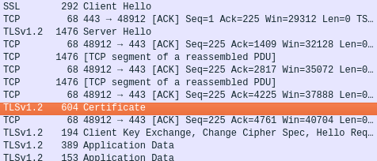

Figure 1. Simplified figure of the usage of the SSL protocol.
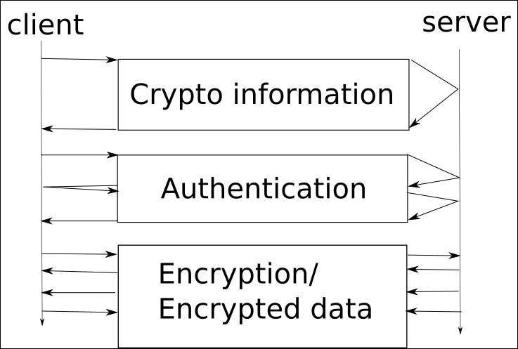

>**There are different methods for SSL handshaking but the one that’s explained above is the most used one when establishing a new SSL connection between a new client and a server.**

### 2.2. Motivation for the use of SSL

**Using SSL**

SSL aims to provide a secure internet connections between servers and clients. It’s the backbone of the secure internet [13]. By using secure SSL libraries correctly you can send and receive messages securely. You also know that the server is really who it says it is just by having a look at the certificates available. Using SSL is more costly for the servers (and clients) than just using plain text but considering the advantages using SSL provides the plain text is usually not used at least in connections that need the security offered. 

**when the connection cannot be established for some reason when using SSL**

The connection can also be established securely and as encrypted in other ways than just by using SSL but the other ways and protocols are not as popular and easy to use as SSL is – at least not securely. If a server does not support SSL it can use many services available to offer i.a. certificates for http servers using https connection between the client and the security provider. This requires that the client supports SNI(Server Name Indication) which for example most modern browsers today do. The SNI support is one of the testing subjects when testing SSL support of libraries and codes, i.e. does the client under test support SNI or not. In case the client does support SNI it can have some security during the connection even when the server does not support SSL - at least in the form of authentication [14].

### 2.3. Motivation for the use of SSL testing

There are a lot of potential clients. Not just the browsers. So does the server really use correct certificates and safe cipher suites is a really good question and an important subject to do research on. Does the client check the certificates correctly. Does the client allow only the safe ciphers or does it also accept the use of the ones that are less secure. Maybe you just want to know the ciphers and SSL protocol versions supported by the library in use. Maybe you are creating a new library and want to test whether if the SSL handshake is done correctly or not.

The world of security on the internet is still an evolving one. It’s changing all the time.  New bugs get found and they need to be batched either by retiring the insecure protocols and ciphers or finding new ways to fix them. New standards get developed. New algorithms find their way into the world of secure internet communication. The capacity and speed of the computers increases every day – so does the attack surface of brute force required attacks. 

All the security used today is going to be outdated sometime in the future. New protocols and algorithms developed need to be tested correctly before using them, even if they are believed to be extremely safe at the time being.

### 2.4. Popular known vulnerabilities

**DROWN [20]**

Drown stands for Decrypting RSA with Obsolete and Weakened eNcryption. “It allows an attacker to decrypt intercepted TLS connections by making specially crafted connections to an SSLv2 server that uses the same private key”. Many of the servers vulnerable to DROWN are also affected by Openssl bug that results in a significantly cheaper version of the attack and a larger attack surface.

**POODLE [21]**

POODLE stands for Padding Oracle On Downgraded Legacy Encryption. Any SSLv3.0 with CBC(Cipher Block Chaining) can be vulnerable to POODLE attack. POODLE allows attacker to decrypt selected content within the SSL session. POODLE attack can be performed in some cases even if the server and the client both support upper TLS versions by downgrading the connection during protocol version negotiation between the client and the server.

**BEAST [22]**

BEAST stands for Browser Exploit Against SSL/TLS. TLSv1.0 and earlier protocols allow attacker to guess what the plain text of the data looks like. With enough guesses the attacker can get enough information out of the encrypted data to decrypt cookies flowing by. The attack has been batched but the batch is not on by default. The attack was found by Juliano Rizzo and Thai Duong. 

**SLOTH [31]**

Security Losses from Obsolete and Truncated Transcript Hashes. Usage of RSA-MD5 in TLSv1.2 leads client authentication to be broken and server authentication to possibly be breakable by a powerful adversary. “Partly as a consequence of this work, the TLS working group has decided to remove RSA-MD5 signatures and truncated handshake hashes from TLS 1.3“. MD5 signatures are still used in TLS today even though it has been known to be cryptographically broken since at least 2005.  Using MD5 means that the security of server signatures is 128 bits but using a transcript collision attack by Karthikeyan Bhargavan and Gaetan Leuren the effective security can be halved to about 64 bits and for other mechanisms such as TLS/SSL client authentication the security losses are even more dramatic.

Before TLSv1.2 the SSL client authentication signing hash function was always a concatenation of MD5  and RSA. TLSv1.2 allowed clients and servers negotiate algorithms they support and hence both the use of weaker and stronger algorithms. Many libraries and implementations allow the use of RSA-MD5 signatures. Can be used in Man-in-the-middle client impersonation attack using collisions in the use of weak RSA-MD5 signatures. The attack takes up to several hours on Amazon EC2 instances. Attack can also Man-in-the-Middle Credential Forwarding Attack colliding two ClientFinished messages which are 96 bit HMAC hashes. This takes only up to 2^42 HMAC computations to calculate. This attack is important because about [31% of HTTPS servers are currently(2015) willing to send RSA-MD5 server signatures](https://securitypitfalls.wordpress.com/2015/12/07/november-2015-scan-results/). 

For more detailed information: [Transcript Collision Attacks: Breaking Authentication in TLS, IKE, and SSH] (http://www.mitls.org/downloads/transcript-collisions.pdf) by Karthikeyan Bhargavan and Gaetan Leuren.

**Pandora’s box – KCI [32]**

KCI (Key Compromise Impersonation) vulnerability is a weakness of an authenticated key exchange protocol that allows attacker who has compromised the secret client credentials(e.q. client certificate and corresponding secret key) of a victim to impersonate any server to the compromised client. If an attacker gets to install a client certificate in victims computer the certificate can be used to also authenticate servers by leveraging the KCI vulnerability of certain cipher suites in TLS. Because the attacker can use client servers to impersonate a server there will be no warning displayed for the user when installing the certificates. All TLS fixed (EC)DH (Elliptic curve Diffie-Hellman) handshakes are vulnerable to KCI.

For more detailed information: [Prying open Pandora's box - KCI attacks agains TLS] (https://www.usenix.org/system/files/conference/woot15/woot15-paper-hlauschek.pdf) by Clemens Hlauschek, Markus Gruber, Florian Fankhauser and Christian Schanes.

**Logjam [33]**

“The Logjam attack allows a man-in-the-middle attacker to downgrade vulnerable TLS connections to 512-bit export-grade cryptography.” The attack is reminiscent of the Freak attack but is due to a flaw in TLS protocol and attacks DH(Diffie-Hellman) key exchange. 8.4% of the 1 million domains were initially vulnerable. The attack allows man-in-the-middle attacker to downgrade connections towards the server from client and take over the connection towards the client by impersonating the server. With 768 bit, 1024 bit or bigger keys much more time would be needed to implement the attack and thus the attack is not really valid with the current computers. It’s recommended to use primes of 2048 bits or larger because it would take far too many years to calculate the attack.

For more detailed information: [Imperfect Forward Secrecy: How Diffie-Hellman Fails in Practice] (https://weakdh.org/imperfect-forward-secrecy-ccs15.pdf) by David Adrian , Karthikeyan Bhargavan, Zakir Durumeric, Pierrick Gaudry, Matthew Green, J. Alex Halderman, Nadia Heninger, Drew Springall, Emmanuel Thomé, Luke Valenta, Benjamin VanderSloot, Eric Wustrow, Santiago Zanella-Béguelin and Paul Zimmermann

**Bar Mizvah - Breaking SSL with a 13-year old RC4 Weakness [34]**

“RC4(Rivest Cipher 4) is the most popular cipher in the world even though it suffers a critical – and long known – weakness known as Invariance Weakness.”. RC4 is not secure. RC4 is one of the simplest cryptographic algorithms. The data encrypted using RC4 is encrypted from the plaintext using pseudo random generated bytes that get XOR-ed with the plaintext bytes. 

This attack can be used to mount partial plaintext recovery attacks on SSL-protected data. Using it one can recover up to 100 bytes of encrypted data. The usage of RC4 is distinguishable from random. During the attack the attacker first sniffs a large number of SSL connections encrypted with RC4, waiting for a arrival of a weak key. Attacker can then use statistical biases to aggregate tiny pieces of plaintext information using LSBs(least significant bits) of up to a hundred secret bytes. The attack can also be used to brute force attack cookies.

For more detailed information: [Bar Mizvah - Breaking SSL with a 13-year old RC4 Weakness] (https://www.blackhat.com/docs/asia-15/materials/asia-15-Mantin-Bar-Mitzvah-Attack-Breaking-SSL-With-13-Year-Old-RC4-Weakness-wp.pdf)

**Freak [35]**

Freak(Factoring RSA Export Keys) attack targets a class of deliberately weak export cipher suites. These weak algorithms were introduced under pressure of US governments agencies while stronger algorithms were banned from export. By design an export cipher suite must be less than 512 bits long. It is very easy for an attacker to factore the modulus required to impersonate a server to vulnerable clients.

For more detailed information and links: [Freak: Factoring RSA Export Keys] (https://mitls.org/pages/attacks/SMACK#freak)

**Poodle bites again [36]**

TLS’s padding is a subset of SSLv3 so SSLv3 decoding could be used in TLS and it would not cause any problems in normal operation. However it SSLv3 decoding would not check the padding bytes which would make the POODLE attack to work against TLS connections. There are sites that are affected by this.

For more detailed information: [The 	POODLE bites again] (https://www.imperialviolet.org/2014/12/08/poodleagain.html)

**Heartbleed Bug [37]**

"The (1) TLS and (2) DTLS implementations in OpenSSL 1.0.1 before 1.0.1g do not properly handle Heartbeat Extension packets, which allows remote attackers to obtain sensitive information from process memory via crafted packets that trigger a buffer over-read, as demonstrated by reading private keys, related to d1_both.c and t1_lib.c, aka the Heartbleed bug."

**Crime [38]**

The CRIME(compression Ratio Info-leak Made Easy) exploit was created by the security researchers Juliano Rizzo and Thai Duong, who also created the Beast exploit. The CRIME exploit allows attacker to perform session hijacking on authenticated web session over connections using HTTPS and SPDY(SPeeDY) protocols that also use data compression. The exploit against HTTPS and SPDY is mostly mitigated but against HTTP not so much.

**Others**

There are many more vulnerabilities found all the time. In OpenSSL alone there have been at least 16 vulnerabilities that needed fixing in 2016 till today(06.2016) [23].

### 2.5 Related protocols and approaches for securing connections on the internet

**Opportunistic security - in the context of communications protocols: [39, 40]**

Normally i.a. SMTP connections either authenticate and encrypt or do nothing special to secure the connection, at least when correctly implemented. The opportunistic security approach allows the use of encryption even when no authentication is available. The handshake between a SMTP server and a client begins with a STARTTLS command. The communication before the command is done in plain text which of course allows an attacker to prevent the command to have any affect on the connection, meaning even though the client wanted to start using TLS/SSL the attacker can force the client to use plain text if the client does not force the usage of either authentication and encryption or no connection at all. 

“A publicly-referenced SMTP server MUST NOT require use of the STARTTLS extension in order to deliver mail locally.  This rule prevents the STARTTLS extension from damaging the interoperability of the Internet's SMTP infrastructure”

**Minimal Unauthenticated Encryption [1]**

MUE(Minimal Unauthenticated Encryption), i.e. uses a few round trips as possible Designed against passive surveillance, does not work against active ones. Offers a fast way within HTTP/2 to cause unauthenticated encryption. The protocol starts encryption within 3 messages (1.5 round trips), there are protocols that can start encrypting with less than that, but their error handling is much more complicated and they can also take more than just 2 round trips. MUE is negotiated in HTTP/2 headers. The two parties must agree to a shared preliminary key using (anonymous) Diffie-Hellman key agreement and derive the shared keys using agreed-to KDF(Key Derivation Function) and start encrypting messages.

The client is always the one who whether to start encrypting. The server can always Reject the encryption if it either doesn’t want to start encrypting with the client or doesn’t support algorithms available. Doing encryption in the HTTP/2 means also that when moving to encrypt the connection changing port is not needed, the port 80 can still be used. MUE is only for http but there is no security problem using HTTP that is carried under TLS/SSL.

**Password-Authenticated Key Excange [41]**

In PAKE(Password-Authenticated Key Exchange) two parties share a password which they both use to mutually authenticate. The protocol should not allow an attacker to obtain any information about the password through simple eavesdropping. The protocol uses Diffie-Hellman key exchange with a password as an extra layer of protection. J-PAKE means juggling PAKE in which the password is combined with ephemeral values like in the standard Diffie-Hellman key exchange instead of using only the password provided to obfuscate the inputs to a key exchange.

For more detailed information: https://www.normalesup.org/~fbenhamo/files/publications/SP_AbdBenMac15.pdf

**Others:**

There are many more protocols and approaches developed to be used either combined within or without TLS/SSL. Some of these are more secure and the others are less. The main scope of this thesis is in secure communications over TLS/SSL so this thesis won’t be getting deeper into the protocol soup at hand for now.

### 2.6. SSL testing

No matter what internet protocol(s) you are using with SSL protocol. The handshake part is almost always the same or at least a similar one. The protocol version, cipher suite, etc. get chosen during the handshaking. If the connection gets established the two participants - the client and the server - are to use the configuration negotiated in the SSL handshake part of the connection. The actual data exchange part is done differently when using different protocols. It is out of the scope of this thesis, so we won’t be getting into that too closely.

**Introduction into SSL-testing**

Even though the world of internet may be pretty secure for now. Who is to tell the code developed to be used in the future of the internet won’t have any bugs or vulnerabilities because of the usage of obsolete SSL. Without SSL testing there would be no way to be sure whether the code in use is safe(ish) or not. 

SSL testing consists of two essential parts. The server and the client or the client and the man in the middle or the server and the man in the middle. It may also consist of all of them.

#### 2.6.1. Different approaches for testing the behavior of SSL libraries and clients during the SSL handshake

**Server side testing**

By server side testing I mean that the information is processed on the server side. The client is only trying to create connection and either does not want to know the result of the tests or does no want to know the result until the end of all the tests. The server on the other hand collects all the interesting data available. 

The server can reason out what client supports and what it does not by observing both the connections established and the packets received. If a connection is not established, the client either does not support the used configurations on the servers or the client does not want to connect to the server which is using broken or otherwise unsupported or unavailable 
certificates. If the connection does not get established the server cannot necessarily always be sure why the client was unable to connect. That is because the server does not always know whether if the client for example lost internet connection or if the client could not support the proposed cipher suites or terminated the connection for any other reason without even telling why.

The results get either sent back to the client or saved on the server after and during the connection. For example QUALYS SSL LABS [15] offers free of charge tests for browsers. The result is sent back to the client after the tests and most likely also saved on the server side as well.

**Client side testing**

By client side testing I mean that the information is processed at least on the client side.  The client knows in most cases what is on the server side behind certain ports or hosts. The client tries to connect to the server side as it did when doing the server side testing. If and when the connection gets established the client knows what it(the client) supports and does not support. The configuration can of course be either a secure or insecure one. The result is also saved at least on the client side.

There are tools that by using them the client can check whether if it is vulnerable to certain attacks. There are also tools that let browsers to know what SSL protocol versions and cipher suites the used user agent supports. For example QUALYS SSL LABS [15]. 

This thesis will mostly concentrate on the tools that check whether the client code supports only secure connections or if it also does support the less secure or insecure ones. The TryTLS backend provides one tool to be used to do just that. The backend can also be used to reason out and save the results on the server side if wanted.

**Packet sniffing**

One way of telling whether the client(or server) supports insecure connections is man in the middle kind if approach to the problem at hand. The man in the middle sniffs the packet flows and reads what either the client or the server supports. The sniffing can be performed either on the client side, on the server side or in the middle of the both. Of course this is in some ways much more difficult approach and thus not valid in most cases.

The server and the client exchange cipher suites, SSL version number and certificates in plain text [16] hence the information required to determine what the client supports can be determined from the packets flowing by. By using the man in the middle approach it is not always possible to figure out what the server supports. That is because of the fact that the server does not necessarily need to send anything but the information the client needs to determine whether if it can connect to the server or not and by using what configuration of cipher suites, protocols and so on.

Figure 2. Main ways for testing SSL in action.
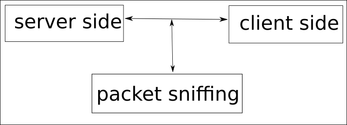

### 2.7. Current testing approaches / State of the art

#### 2.7.1 Overview

**Server**

There are many tools for testing if a server is doing SSL securely. Using for example Wormly Web Server Tester one can get a good overview about the security of a URL. There are also tools for checking the certificate signing request like Symantec SSL Toolbox or OpenSSL provided tools. This is useful to do before asking CA to sign a certificate [3]. There are many more tools but they are mostly outside of the main scope of this thesis or at least out side of this overview. 

**Client**

There are not so many tools for testing SSL support of different clients. There are of course some. For example BADSSL is a service by using of which one can manually test whether if a client code, library or a program performs SSL as wanted. QUALYS SSL LABS provides also some manual tests for the client. TryTLS backend is also for client side testing but can be used on the server side as well.

#### 2.7.2 Tools and backends in more detail

**BADSSL**

Badssl [4] is one of the sites to which you can try to connect and manually figure out whether if something goes wrong when using the code at hand or not. The badssl-servers can also be downloaded onto a computer but the servers can not be shared with public easily. Badssl is meant for manual testing of security UI(user interface) in web clients [17] and is an unofficial Google product. 

**QUALYS SSL LABS**

QUALYS SSL LABS [15] offers free of charge tests for browsers. They have many more projects going on. They also offer deep analysis of the configuration of any SSL web server on the public Internet and have documents, surveys and many different analysis tools for TLS/SSL testing [25].

**WORMLY - FREE DIAGNOSTIC TOOLS**

Tests and diagnostic tools for different kind of servers that support SSL. There are tools for i.a. HTTPS, FTPS, POP3 and HTTP and FTP servers [26]. Wormly also offers services for monitoring app stack and sites.

**SYMANTEC**

Tools for creating certificate signing requests and cheking that they are formatted properly. They also sell certificates and other Cyber security related services and protection [27].

**Others - Not all but many**

* SSL Shopper: Quick tool for checking SSL servers [3].
* GlobalSign SSL Check: Detailed tool for checking SSL servers [3].
* COMODO SSL Analyzer: Quick scan for https url [3].
* SSL Checker: SSL checker that can be set to remind 30 days before a certificate expires [3].
* HowsMySSL: Tool for testing browsers TLS/SSL support/compatibility [3].
* DigiCert: SSL certificate installation diagnostics tool and certificate management services among others[29].
* SSLSmart: tool aimed at improving efficiency and reducing false positives during SSL testing [28].
* SSL Checker: Tool for showing SSL certificate details [30]
* CSR Decoder: Tool for verifying the details of a certificate [30]
* SSL Finder: Tool for finding best match SSL product [30]

### 2.8. Problems with the current testing approaches

The current tools that check whether if the client supports insecure configurations need at least mostly internet connection to work properly. The tools I am talking about are mostly internet sites. There are also tools for checking Certificates. But most of the tools are not for checking whether if the client checks the certificates correctly or not [3]. With badssl and TryTLS one can of course do just that.

Most of the current approaches are also in a way more difficult to reconfigure for the needs of individuals. TryTLS tries to make the process on reconfiguration as easy as possible. Obviously as seen there are already tools that provide at least some sort of testing environment for SSL clients to test on but they are in one way or another different from the TryTLS backend and as it often times is with testing tools – There are newer too many of them.

## 3. trytls backend

Figure 3. Simple figure of the TryTLS backend
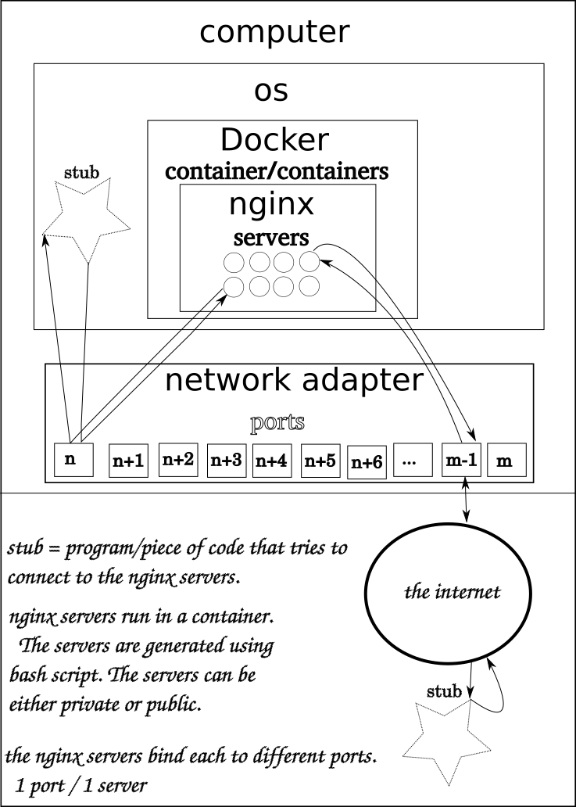

### 3.1. Terminology

In this thesis term ‘connection’ refers mostly to a TCP connection between a client a server. Connections between clients and the TryTLS backend servers are mainly HTTPS connections even though it is possible to test for example IMAP connections using the TryTLS backend.

### 3.2. Tools used

**Docker** 

Docker is a virtualization software [17]. It is an open source project to pack, ship and run any application as a lightweight container. Docker relies on a sandboxing method called containerization. Docker containers wrap a piece of software in a complete file system. Docker containers are small and the performance overhead is almost zero. Containers are also completely portable and the design is application-centric instead of being hadrware-centric as the traditional virtualization methods tend to be. Docker operates at the OS level, so it can even be ran inside a VM (Virtual Machine). Docker works on among other platforms on Linux, Windows and Mac at the moment. It can be ran on any infrastructure. The containers are also isolated from one another by default [5].

In the TryTLS backend the nginx servers and files required to run the servers are placed inside a docker container. The docker provides an easy way to ship the backend from one computer to another one. Using docker to virtualize the servers assures very short maintenance breaks when updating the servers because the servers need to be shut down only when rebuilding and starting the servers.

**Bash**

Bourne Again Shell is sh-compatible and most sh-scripts can be run by bash without modifications. Bash is default shell on most Linux and OS X distributions. Bash is almost 30 years old language. During the testing part of this thesis mostly bash and python are used. In the TryTLS backend bash scripts generate the servers and docker files used to build the docker images and to run the built images. [6]

**nginx**

“nginx [engine x] is an HTTP and reverse proxy server, a mail proxy server, and a generic TCP/UDP proxy server, originally written by Igor Sysoev.” [7].

Nginx is used by many of the most popular sites like Netflix [7]. Nginx open source project started 2002. Nginx offers an easy way to create very powerful servers in a short time. It can also be used in docker containers as is done in TryTLS backend.

**Openssl**

Openssl is and Open source project. It is a toolkit for TLS and SSL protocols. It also comes with a general-purpose cryptography library. Openssl is used in TryTLS backend to generate the self signed certificates required. Openssl is also used in Nginx servers. Openssl is one of the most popular libraries used in SSL [8] both in server- and client side.

### 3.3. Setting up servers

Figure 4. Setting up the TryTLS servers
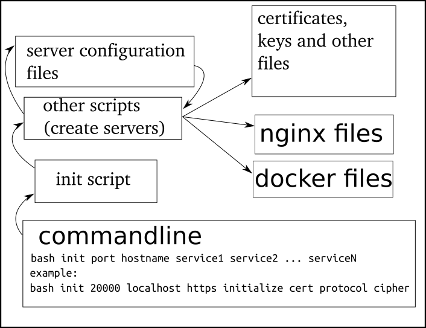

Setting up the TryTLS backend is easy. The init script the generates the files that docker needs simply takes host name, port, protocol and services as commandline arguments. Currently implemented version of the backend only supports HTTPS protocol.

Figure 5. Building and running the servers
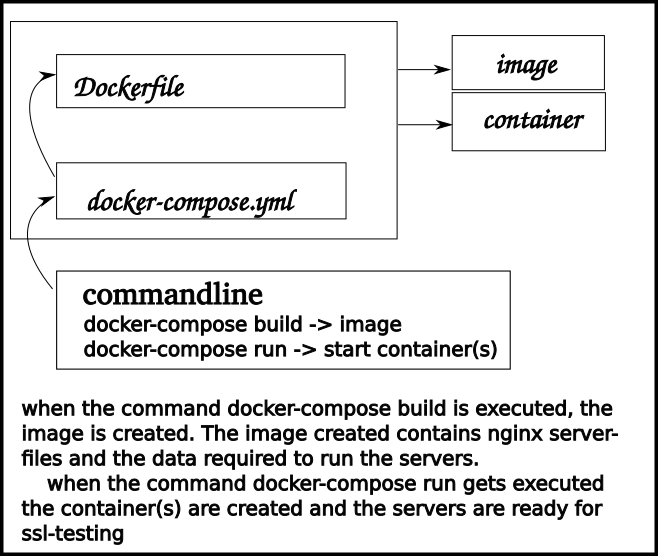

**Setting up servers on localhost**

When setting up the TryTLS backend the host name can also be set either to localhost or 127.0.0.1. By running the init-script and setting host name to localhost the certificates and servers are generated especially for the localhost.

**Setting up public servers**

If the host name is set to either to the public ip address of a computer or to a domain name that points to an ip one can try to connect to the servers and therefore test their code against the servers running on a computer. 

When the init-script is executed it generates a couple of files and folders in a folder called tmp. Inside of which you can find certs folder and conf-file among others. If both the certs folder and the conf-files of all the servers publicly running were shared in a same place it would be easy for people to create different configurations on their servers and let the runners that run the stubs that try to connect to given server test all the servers by looping thru all the conf-files and using the correct certificates - if self signed. The certificates are generated using the TryTLS init scripts, the certificates that TryTLS uses when running can also be generated in other ways if wanted.

**Setting up other servers using the TryTLS backend**

The TryTLS backend int-scripts are coded is such a way that it is easy to change the now generated HTTPS servers for example into FTPS servers. Because of the usage of docker even the nginx can be changed into another for example to vsftpd [9] which is used in FTPS servers.

### 3.4. Testing ssl testing behavior of clients using trytls backend

To test whether a client does allow usage of insecure connections or not you need to be able to run that code on your computer. Alternatively you can use one of the runners available. One of the runners is also developed by be. The runner I developed can run any code(stub) you want it to run to against any number of backends using many different drivers if the drivers required have been written. Using multiple drivers allows to test the code in action using many different versions of the software or libraries needed to run the code developed or even different operating systems to run the drivers and stubs on. You can run the code against both private and public servers.

Figure 6. Running stub against the backend using bashTLS with one driver (similar figure with other runners)
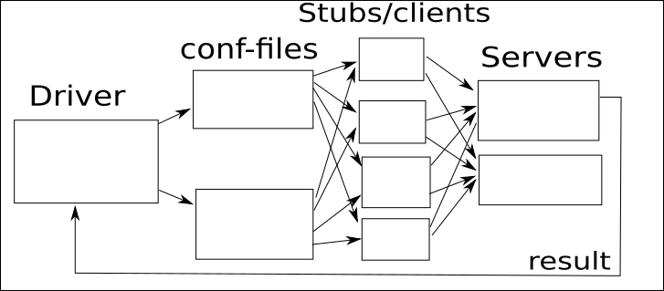

## 4. Testing

### 4.1. Generally

In this thesis the testing is done by trying to connect the client to both insecurely/wrongly and correctly but differently configured servers. The testing is done mainly on the client side although when using the TryTLS backend locally the servers are also available if needed.

### 4.2. TryTLS backend configuration

The testing against TryTLS backend is done by trying to connect to the differently configured ports open. Running the init script the script generates files. Among the files generated there is a file called conf-file inside of which you can find all the different configurations on the different ports on that particular server.

Picture 2. Example conf-file. Includes port, message, status, certificate and host name fields.
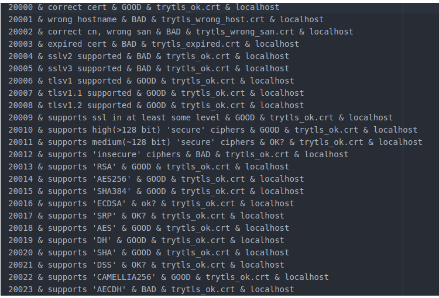

**Default configuration**

The default configuration of the TryTLS backend includes tests for the support of different versions of SSL protocols. There are also tests for testing the support of different cipher suites incorrect certificates.
The default configuration is easily editable. By running the init-scripts with different commandline arguments one can remove the wanted tests from the default configuration.

#### 4.2.1. Editing configuration

Editing default configuration is easy. Only thing needed to do is add/remove the wanted lines in the configuration folder of the particular protocol used. If testing SSL handshake and client’s support for SSL the configuration used is best to keep as it is but you can of course add new configurations and tests. Only the configuration files need to be edited to make new configurations.

When using edited configuration files it is especially important to use the newly created conf-file as well. That’s because of the changed configurations behind different ports. The conf-file is universally usable, i.e. the same kind of files can be created (and have already been created by me) for other backends like BadSSL as well.

The scripts are also written in such a way that it is not too hard to edit them as wanted for example to add new ways for certificates to be broken or to add new commands for the configuration files to be able to use them to, etc. 

### 4.3. Output samples and conclusions

#### 4.3.1. Performance testing

Performance testing is always an important part of testing new tools. It shows the best ways to use the tools and whether if they really are usable or not in the sense of being reasonably good with not wasting too much time.

The tests are done using python3 and urllib on the client side code. The server side is the TryTLS backend with default configurations. All the tests are done 10 times and the values represented on the next pages are the average values of the actual values measured during the 10 tests. In the beginning of each test the servers have been rebooted. During a test the client(s) tries to connect to all the servers up and running. If the connection is established the client also makes a Get request for a html file. Once the html file has been safely received by the client or something has gone wrong with the connection - the connection gets terminated. These tests test not only the speed of creating connection – the handshake part of the connection - but they also measure the speed of cryptography - the record part of the connection.

The tests were performed using 64 bit Linux Ubuntu 16.04 laptop with Intel core i3 2.27 GHz, normal networking controllers and 4 gigs of ram.

**Test 1**

The first tests were made setting up one backend with different numbers of servers and containers. During the tests there were never more than one client trying to connect at a time. The time it took from a client to connect to a server and end the connection was recorded and the result is shown in the table below. 

It can be seen that the servers are very fast even though the client and the servers are running on the same machine. Within certain range of servers up there is really no noticeable change in the rate of connections. It took about 200 milliseconds for the client to try create a connection and optionally make a GET request for a html file if connection got established. The servers were easy to set up and terminate because of the usage of docker.

Chart 1. Summary of test runs of the TryTLS backend with single client.
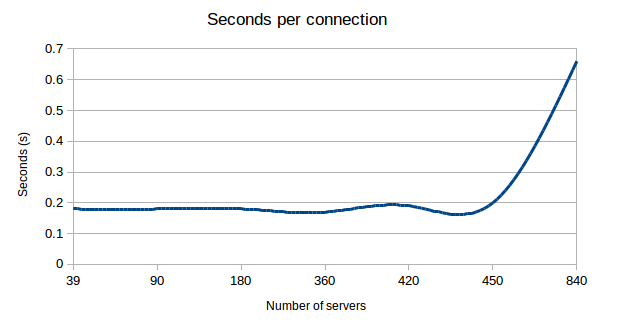

Number of containers | Number of servers | Seconds per connection(only one connection at a time)
------------ | ------------- | -------------
1 | 39 | 0.18
1 | 90 | 0.18
1 | 180 | 0.18
1 | 360 | 0.17
1 | 420 | 0.19
1 | 450 | 0.20
1 | 840 | 0.66
2 | 78 | 0.19
4 | 117 | 0.18
5 | 156 | 0.20
6 | 195 | 0.20
7 | 234 | 0.18
8 | 273 | 0.18

**Test 2**

The tests were made setting up one backend with 8 containers and up to 273 servers. The tests were performed otherwise the same way as during the ‘Test 1’ but now the number of connections was the changing variable. All the clients are trying to connect to the same port at the beginning of the tests. Once a client gets connected it moves to the next port and so on.

Yet again the rate in which the connections were established was very good until certain limit of simultaneous connections. Probably with better computer this test would have had better results but I had no change of finding that out. The chart looks pretty similar to that of the ‘Test 1’.

At the beginning adding more simultanous connections increases the performance. i.e. decreases the time it takes a client to try and connect to a port, do what needs to be done and terminate the connection. To a point it is useful to add more connections but adding too many connections in turn slows the servers down considerably.

The ‘seconds per connection’ term means it took that much time for one client to connect to the server, get the html page and terminate the connection or just try to connect and terminate the connection if no succeess when connecting. Only one connection can be established to one port at the same time and all the clients are trying to connect to the same ports at least at the beginning of the test runs.

Chart 2. Summary of test runs of the TryTLS backend with multiple clients.
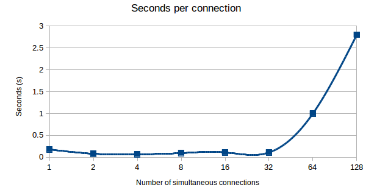

Number of connections | Seconds per connection
------------ | -------------
1 | 0.18
2 | 0.082
4 | 0.069
8 | 0.097
16 | 0.11
32 | 0.11
64 | 1.00
128 | 2.8

#### 4.3.2. TryTLS backend example test run

This is an example output when using BashtTLS(bash based) runner to run python3 urllib stub against the TryTLS backend. The upper picture is taken on the client side, i.e. the output of the runner. The other picture is taken on the server side.  

**Client side**

“VERIFY FAILURE” means the connection did not get established and the “VERIFY SUCCESS” message means the connection did get established. The [SUCCESS] means that the connection worked as wanted.

Picture 3. Test run against TryTLS backend using BashTLS runner and python3-urllib stub.
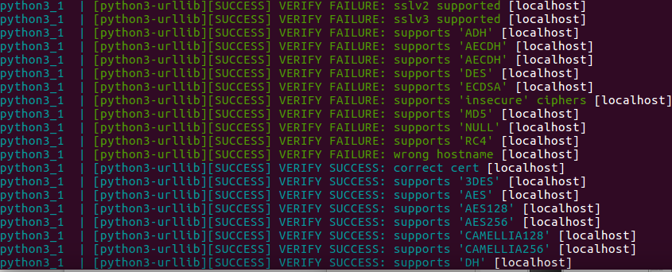

**Server side**

As it can be seen below the data could be gathered and processed on the server side if wanted. Obviously just by saving the log files it could be later on reasoned out with pretty good accuracy what the client that tried to connect supports and what it does not.

Picture 4. Test run against TryTLS backend using BashTLS runner and python3 - urllib stub as a client.
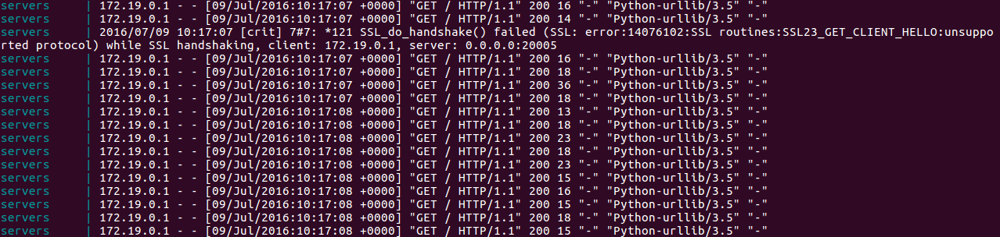

## 5. FUTURE RESEARCH

### 5.1. Generally

There are quite a few tools for checking SSL support and behavior of codes and libraries already but there are neither many good tools that use the combined power of different testing methods and results available efficiently nor good documentations how to use the already existing tools to gain the best results possible or at least there used not to be. There are researches going on trying to gather information about existing tools and vulnerabilities, for example SSL Labs has been doing this among other things since 2009 [19] and will hopefully keep up the good work.

There are still network UI(User Interface) clients that still use SSLv2, SSLv3 or TLSv1.0 even though there are a lot of issues and vulnerabilities like DROWN attack(SSLv2), POODLE attack(SSLv3) and possibility for BEAST attack(TLSv1) if not mitigated correctly. TLSv1.1 and TLSv1.2 are still without known serious security issues and it’s recommended to support at least the usage of TLSv1.2 because only it provides modern cryptographic algorithms [19]. The fact that the TLSv1.1 and TLSv1.2 are without known security issues does not necessarily mean that there aren’t any or at least that there won’t be any in the future.

In the future it’s important to research new ways to make SSL more secure, more efficient and especially more widely used protocol. The currently most popular SSL protocol versions and algorithms should be researched in the future. Even the old protocols such as TLSv1.0 should still be researched because they are still widely used. The currently running testing backends and web sites should also be updated as the evolution of SSL goes forward.

### 5.2. Trytls backend

There is quite a lot of potential in the TryTLS backend. Its very configurable and could potentially be used in various other kind of experiements and test in the future. It will be seen what the future holds for the backend if it in fact does.

**Certificates**

There are and will be especially in the future a lot more different ways for the certificates generated to be broken than the current versions of the scripts and configuration files provide. But now that the TryTLS backend is working and easily configurable the updating of the backend won’t be particularly difficult.

**Vulnerabilities**

The backend could also provide information about whether if the client trying to connect to the server is vulnerable to the known vulnerabilities.

### 5.3. Application Possibilities

As mentioned before the TryTLS backend could also be used in various different kind of servers and secure internet connection tests. The backend could also be extended in many other ways. The init-scripts create conf-files and certificates when ran. If there was a service sharing these conf-files and certificates anyone could participate into making the usage of SSL client safer by configuring their servers differently than the other participants have. This is one thing that needs to be considered if seen useful.

The backend created could also be part of something bigger. It could be combined together with different tools created for testing SSL. The backend can also be used for creating virtual servers for sites with variety of purposes if configured correctly but that is not the main purpose for the backend. 

There are also a lot of different tools for SSL testing purposes that could be created but haven’t been at least yet. These tools to be developed include better tools for testing the SSL support of clients by sniffing the packets sent and received. This can be obviously be done using for example Wireshark or sites on the internet, but a real time automated locally usable, easily configurable tool would be better suited for the job in some cases. One of the internet sites designed for this is DC Sec [24]. Even though this approach would still require a responding web server to be useful it is very doable also with the TryTLS backend.

Picture 5. Using Wireshark to check what cipher suites client (Firefox) supports.
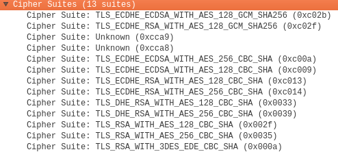

## 6. Conclusions

The main goal of this thesis was to show and research the fact that it is possible to do SSL testing for different programming languages and libraries without and within internet connection. The thesis is also about creating a software or tool that anyone can with relatively small amount of work set up and get running in no time if wanted. There are already similar backends and tools out there on the internet just waiting to be used more in SSL testing.

Even though there are tools for testing the SSL protocol still many of the libraries used do something wrong or insecurely or let the client do something insecurely without really providing the possibility of choosing whether to accept the connection or not. With the created backend and also with many of the existing other tools anyone can check whether if the code used can connect - even though not necessarily wanted – insecurely either using known vulnerabilities or natively(without having to use any real vulnerabilities). The TryTLS backend is very fast and comes with a great potential both for configuring the servers as needed and testing SSL libraries as it is.

If you do not want to just believe what everyone else is telling you about the code you are using. Whether if they are telling that it is safe to use the code or not, you have or should at least have always the possibility of testing the code using any of the tools available or creating new ones if needed. Including TryTLS backend. 

Of course the code is not necessarily safe even if it passes all the tests. Or it can be safe for now but the future will always bring us new challenges. Isn’t that just the point of living – having difficult(ish) challenges?. 

## 7. References

[1] P. Hoffman. VPN Consortium. (2013). "Draft-Hoffman-Httpbis-Minimal-Unauth-Enc-01 - Minimal Unauthenticated Encryption (MUE) For HTTP/2". Tools.ietf.org. N.p., 2016. Web. 15 July 2016. Available: https://tools.ietf.org/html/draft-hoffman-httpbis-minimal-unauth-enc-01

[2] T. Dierks. E. Rescorla. RTFM, Inc. (2008). RFC 5246. - The Transport Layer Security (TLS) Protocol Version 1.2". Tools.ietf.org. N.p., 2016. Web. 11 July 2016. Available: https://tools.ietf.org/html/rfc5246 pp. 32-33

[3] C. Kumar. (2016). Infrastructure, Web et al. "10 Online Tool To Test SSL, TLS & Latest Vulnerability". Geek Flare. N.p., 2015. Web. 11 July 2016. Available:  https://geekflare.com/ssl-test-certificate/

[4] "Badssl.Com". Badssl.com. N.p., 2016. Web. 11 July 2016. Available:  https://badssl.com/

[5] "What Is Docker?". Docker. N.p., 2015. Web. 11 July 2016. Available: https://www.docker.com/what-docker

[6] "Bash - GNU Project - Free Software Foundation". Gnu.org. N.p., 2016. Web. 11 July 2016. Available: https://www.gnu.org/software/bash/

[7] "Nginx". Nginx.org. N.p., 2016. Web. 11 July 2016. Available: https://nginx.org/en/

[8] OpenSSL Foundation, Inc. "Openssl". Openssl.org. N.p., 2016. Web. 11 July 2016. Available: https://www.openssl.org/

[9] "Vsftpd - Secure, Fast FTP Server For UNIX-Like Systems". Security.appspot.com. N.p., 2016. Web. 11 July 2016. Available: https://security.appspot.com/vsftpd.html

[10] "Curl - SSL Libraries Compared". Curl.haxx.se. N.p., 2016. Web. 11 July 2016. Available: https://curl.haxx.se/docs/ssl-compared.html

[11] "Testing For Weak SSL/TLS Ciphers, Insufficient Transport Layer Protection (OTG-CRYPST-001) - OWASP". Owasp.org. N.p., 2016. Web. 11 July 2016. Available:   https://www.owasp.org/index.php/Testing_for_Weak_SSL/TLS_Ciphers,_Insufficient_Transport_Layer_Protection_(OTG-CRYPST-001)

[12]  GMO GlobalSign Inc. N.p., 2016. Web. 11 July 2016. Available: https://www.globalsign.com/en/resources/white-paper-ssl-secure-server-certificates.pdf

[13] "Why SSL? The Purpose Of Using SSL Certificates". Sslshopper.com. N.p., 2016. Web. 11 July 2016. Available: https://www.sslshopper.com/why-ssl-the-purpose-of-using-ssl-certificates.html

[14] Matthew Prince. (2014). "Introducing Universal SSL". CloudFlare. N.p., 2014. Web. 11 July 2016. Available: https://blog.cloudflare.com/introducing-universal-ssl/

[15] "Qualys SSL Labs". Ssllabs.com. N.p., 2016. Web. 11 July 2016. Available: https://www.ssllabs.com

[16] Sarath Pillai. (2013). "Understanding SSL Handshake Protocol". slashroot.in. N.p., 2016. Web. 11 July 2016. Available: http://www.slashroot.in/understanding-ssl-handshake-protocol

[17] "Docker/Docker". GitHub. N.p., 2016. Web. 11 July 2016. Available:  https://github.com/docker/docker

[18] "Google/Badssl.Com". GitHub. N.p., 2016. Web. 11 July 2016. Available:  https://github.com/google/badssl.com

[19] "Ssllabs/Research". GitHub. N.p., 2016. Web. 11 July 2016. Available:  https://github.com/ssllabs/research/wiki/SSL-and-TLS-Deployment-Best-Practices

[20] Sarah Madden. Christian Dresen. (2016). "DROWN Attack". Drownattack.com. N.p., 2016. Web. 11 July 2016. Available: https://drownattack.com/

[21] (2014). "SSL 3.0 Protocol Vulnerability And POODLE Attack | US-CERT". Us-cert.gov. N.p., 2016. Web. 11 July 2016. Available: https://www.us-cert.gov/ncas/alerts/TA14-290A

[22] Duong, Thai. (2011). "Thái: BEAST". Vnhacker.blogspot.fi. N.p., 2011. Web. 11 July 2016. Available: https://vnhacker.blogspot.fi/2011/09/beast.html

[23] OpenSSL Foundation, Inc. "Openssl". Openssl.org. N.p., 2016. Web. 11 July 2016. URL: https://www.openssl.org/news/vulnerabilities.html

[24]  DCSEC research group at Leibniz University Hannover. "SSL Cipher Suites Supported By Your Browser". Cc.dcsec.uni-hannover.de. N.p., 2016. Web. 11 July 2016. Available: https://cc.dcsec.uni-hannover.de/

[25] Qualys, Inc. "Qualys SSL Labs - Projects". Ssllabs.com. N.p., 2016. Web. 12 July 2016. Available: https://www.ssllabs.com/projects/index.html

[26] "Server Monitoring, Web Site Monitoring And Uptime Monitoring - Wormly". Wormly.com. N.p., 2016. Web. 12 July 2016. Available: https://www.wormly.com/

[27]  Symantec Corporation. "Symantec - Global Leader In Next-Generation Cyber Security | Symantec". Symantec.com. N.p., 2016. Web. 12 July 2016. Available: https://www.symantec.com/

[28] "Sslsmart | Mcafee Free Tools". Mcafee.com. N.p., 2016. Web. 12 July 2016. Available: http://www.mcafee.com/us/downloads/free-tools/sslsmart.aspx

[29] "SSL Digital Certificate Authority - Encryption & Authentication". Digicert.com. N.p., 2016. Web. 12 July 2016. Available: https://www.digicert.com/

[30] ClickSSL. "SSL Tools". SSL Certificates by ClickSSL - Cheap Price, Best Quality & Support. N.p., 2013. Web. 12 July 2016. Available: https://www.clickssl.net/ssl-tools

[31] INRIA Paris. INRIA Paris. (2015). "Mitls, Triple Handshake, SMACK, FREAK, Logjam, And SLOTH". Mitls.org. N.p., 2016. Web. 13 July 2016.

[32] Clemens Hlauschek, Markus Gruber, Florian Fankhauser and Christian Schanes. (2015) Prying open Pandora’s box: KCI attacks against TLS. Available: https://www.usenix.org/system/files/conference/woot15/woot15-paper-hlauschek.pdf

[33] David Adrian , Karthikeyan Bhargavan, Zakir Durumeric, Pierrick Gaudry, Matthew Green, J. Alex Halderman, Nadia Heninger, Drew Springall, Emmanuel Thomé, Luke Valenta, Benjamin VanderSloot, Eric Wustrow, Santiago Zanella-Béguelin and Paul Zimmermann. (2015). "Imperfect Forward Secrecy: How Diffie-Hellman Fails in Practice". Available: https://weakdh.org/imperfect-forward-secrecy-ccs15.pdf and https://weakdh.org/

[34] Blackhat asia-15. (2015). Bar Mizvah - Breaking SSL with a 13-year old RC4 Weakness. Available: https://www.blackhat.com/docs/asia-15/materials/asia-15-Mantin-Bar-Mitzvah-Attack-Breaking-SSL-With-13-Year-Old-RC4-Weakness-wp.pdf

[35] "Mitls, (2015), Triple Handshake, SMACK, FREAK, Logjam, And SLOTH". Mitls.org. N.p., 2016. Web. 13 July 2016. https://mitls.org/pages/attacks/SMACK#freak

[36] Langley, Adam. (2014) "Imperialviolet - The POODLE Bites Again". Imperialviolet.org. N.p., 2016. Web. 13 July 2016.

[37] "CVE -CVE-2014-0160". Cve.mitre.org. N.p., 2016. Web. 13 July 2016.

[38] Kelsey, John. (2016) "Compression And Information Leakage Of Plaintext". Fast Software Encryption (2002): 263-276. Web. 13 July 2016. https://en.wikipedia.org/wiki/CRIME and https://en.wikipedia.org/wiki/CRIME#References

[39] V. Dukhovni. Two Sigma. (2014). "Draft-Dukhovni-Opportunistic-Security-06 - Opportunistic Security: Some Protection Most Of The Time". Tools.ietf.org. N.p., 2016. Web. 14 July 2016. Available: https://tools.ietf.org/html/draft-dukhovni-opportunistic-security-06

[40] Facebook. (2014). "The Current State Of SMTP STARTTLS Deployment". M.facebook.com. N.p., 2016. Web. 15 July 2016. Available: https://m.facebook.com/notes/protect-the-graph/the-current-state-of-smtp-starttls-deployment/1453015901605223/

[41] Michel Abdalla. Fabrice Benhamouda. Philip MacKenzie. (2016). "Security of the J-PAKE Password-Authenticated Key Exchange Protocol". Available: https://www.normalesup.org/~fbenhamo/files/publications/SP_AbdBenMac15.pdf
