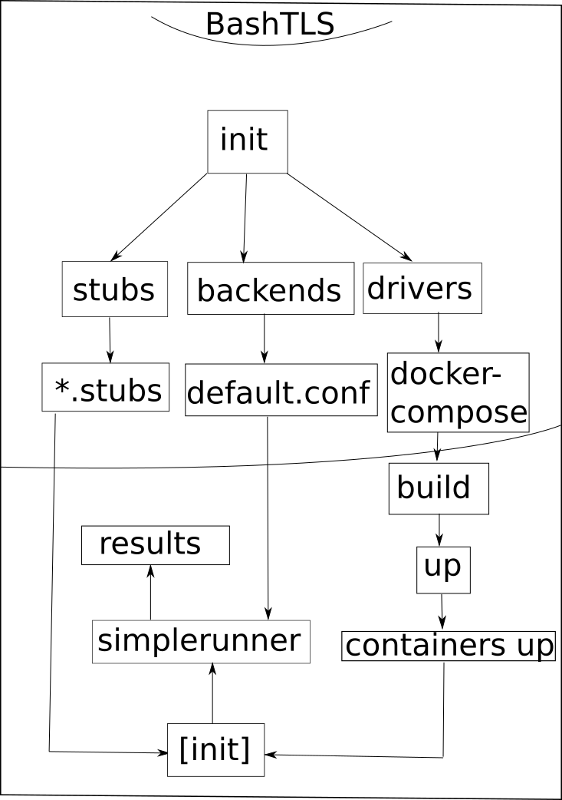

**Work in Progress**

# Get started

## Usage
```
$ bash init <stubspath> <"backend1 backed2 ... backend4"> \ 	#the spaces are of importance
	<language>[:stub1:stub2:...:stubN][&driver1&driver2&driver3]

 * language = used language when running stubs
 * stub1 .. stubN = optional arguments, if not given all stubs will be ran
 * driver1 .. driverN = optional arguments, if not gived all drivers will be used
```

## HOX

### Mac
 * If you are using mac, the stubspath must be relative to the init-script file-path
   * For example: use ../../stubs instead of /users/adada/trytls/stubs

## Examples

```
$ bash init ../../stubs "badssl-all" "python3"
	* run all python3 drivers using all python3 stubs agains all(that are in conf-file) badssl servers

$ bash init ../../stubs "badssl-all" "python3:python3-urllib&python3_1" "bash"
	* run python3(language) python3-urllib(stub) using python3_1(driver) and all bash stubs using all bash drivers
 		against all badssl servers

```
```
$ bash init '../../stubs' "badssl" "java:java-*&javac"
	*run javac driver using all java-* stubs using java-language
$ docker-compose build -> install deps
$ docker-compose up -> start containers:
	1. create ca-certificates(drivers/javac/scripts/init) using ../simplerunner/certs/*
	2. stub in all java-* stubs do
		3. compile stub
			-> success -> run stub -> echo results
			-> failure -> do not run -> echo error
	4.wait till all processes started have been terminated
		-> close container(s)


```
### If you want to run against the trytls backend also, you will have to do for example the following

```
$ #init trytls-backend:
$ cd ../../backends/trytls
$ bash init 20000 localhost https initialize cert protocol cipher
$ docker-compose build

$ #init bashtls
$ cd ../../runners/bashtls
$ cp ../../backends/trytls/tmp/certs/* shared/simplerunner/certs
$ if [ "you aren't using default configuration" ]; then
$ 	cp ../../backends/trytls/tmp/conf* shared/simplerunner/conf/trytls-localhost
	#most of the time this is not needed
$ fi
$ bash init '../../stubs' "trytls-localhost" python3
$ docker-compose build

$ #run trytls
$ cd ../../backends/trytls
$ docker-compose up

$ #run bashtls
$ cd cd ../../runners/bashtls
$ docker-compose up

```

### folders:

 * drivers: bashtls uses these to run the simplerunner and by doing so running the tests against choses backends
 * shared: this file is shared between all the created containers

## Other information

### Settings
```
$ ./shared/simplerunner/settings "parallel" "180" -> Run the stubs in parallel and set timeout to 180
$ ./shared/simplerunner/settings "linear" -> Do not Run the stubs in parallel, leave timeout as it is
```
For more info: [../simplerunner/README.md](https://github.com/ouspg/trytls/blob/bashtls-update/runners/bashtls/shared/simplerunner/README.md)

### Overview

```

BashTLS:
  Init:
    drivers=grep wanted drivers
    for driver in drivers do
    	stubs[driver]=grep wanted stubs
    backends=grep wanted backends
  Run:
    [parallel] For driver in drivers do
      [Init driver] + Run driver
      [semi parallel] For stub in stubs do
        [Init stub]
        For backend in backends do
          [parallel] For line in backend conf do 
            If stub is working then
              If timeout then print timeout
              Else print result

```


#### Simplified picture


